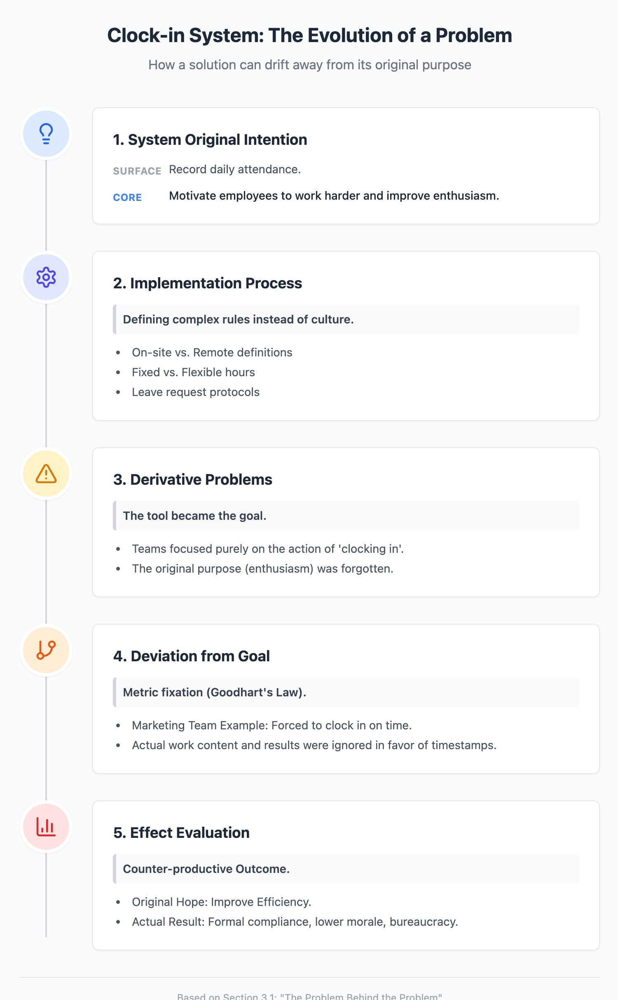
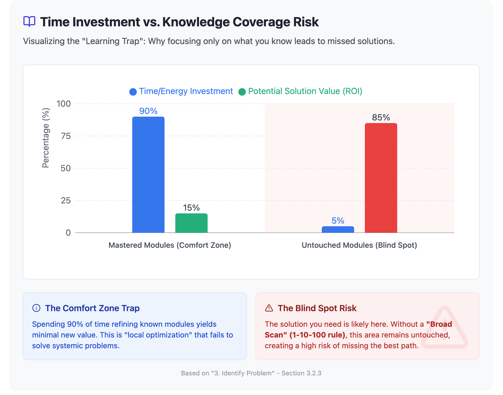

v0.1

# 3. Identify the Problem

The theme of this entire section revolves around solutions to technical problems—a set of routines or frameworks. We have previously discussed some basic principles, and today we will mainly touch upon the principle of being "problem-oriented." As mentioned before, when solving problems, one cannot focus excessively on the solution while ignoring the problem itself. If you get bogged down in designing the solution too early, sometimes the resulting plan actually deviates from the original problem that needed solving.

* Theme focuses on the "problem-oriented" principle
* Emphasizes that focusing on the solution too early may lead to deviating from the real problem
* Reminds us to accurately grasp the problem itself before designing the solution

---

Let's look at an example, a common joke among internet programmers: The user really wants one thing, they express it as another thing, you understand it as something else, and after a flurry of activity, the thing you build is completely diametrically opposed and doesn't solve the user's actual need at all. So, this is a very classic case. When solving problems, we must hold tight to the focal point of the "problem," understand the problem accurately, and then let the solution unfold around the problem. I will skip the rest for now.

* Example emphasizes solution failure caused by communication misunderstandings
* The core is to stick to the problem and avoid misunderstanding
* Solutions should always revolve around the problem

---

Additionally, we talked about the "Six-Step Method," which encompasses the six steps of problem-solving. Today, we will mainly focus on the first step, "Identify the Problem," and the fourth step, "Design the Solution." We will skip the second step, "Break Down the Problem," and the third step, "Prioritize," because these two parts are relatively complex and will be left for later. We are currently assuming we are facing a relatively simple problem, so there is no need to specifically break down or optimize your solution. Therefore, today focuses mainly on the first step of identifying the problem and the fourth step of building the solution.

---

## 3.1 Check Domain Knowledge

OK, let's look at it. Let's skip directly to the third slide and enter the topic: Identifying the Problem. The first step in identifying the problem is to judge how well you master the knowledge in this domain. For example, do you understand the background knowledge and basic concepts involved in this problem? For instance, there may be no one here who has studied biomedicine. If we are suddenly asked to solve a biomedical-related problem, such as the currently popular topic of using AI to develop new drugs. If someone says: "We now want to develop a system that uses AI to analyze combinations of various chemical equations to formulate new drugs that can cure diseases." If this kind of problem is thrown out, probably no one present can truly solve it, myself included.

* Identifying the problem must start with domain knowledge
* Lack of background knowledge leads to an inability to effectively solve the problem
* Uses AI new drug development as an example to illustrate the challenge of unfamiliar domains

---

This type of situation belongs to where we have absolutely no concept of the relevant professional knowledge. Under the premise that everyone is uninformed, there is no way to talk about how to solve the problem. Of course, in reality, we often know a little bit about the relevant background more or less, but at least when starting to deal with a problem, we need to make a judgment first: Did I actually understand this problem? Sometimes, completely not understanding is actually okay; what is most feared is thinking you understood when you actually didn't—that is the most awkward situation. Next, we will expand on this type of situation in detail.

* Mistakenly thinking you understand the problem is more dangerous than completely not understanding
* Before starting to process, you must judge whether you truly "heard and understood"
* Subsequent content will expand on the specific exploration of misunderstanding risks

---

So the first step is to judge whether I truly understand the background situation of this problem. This involves some other details, which we will clarify bit by bit later. The second point to note is, when I discover that I lack the necessary knowledge reserves in certain aspects, how should we respond in order to understand and solve this problem? This involves some common basic coping methods, which we will also break down and explain in detail.

* Two keys: Do I understand the background & How to deal with knowledge blind spots
* Will introduce common methods for supplementing knowledge later
* Need multi-faceted self-verification during the problem identification phase

---

The focus of the third part is: Even if I possess sufficient knowledge reserves and understand the general concept of the problem, I might still overlook the "problem behind the problem." Because often, for example, when we work on a project or modify a feature, when the task description comes, it often only superficially describes what to do or what to change, but behind it, there are often deeper motivations or other problems.

* Sufficient knowledge ≠ Problem identification is in place
* Surface tasks often conceal deeper motivations
* Advise exploring the root of requirements deeply when identifying problems

---

For example, I think there is an interesting example: We introduced a clock-in (attendance) system last year. On the surface, it was to record attendance, but actually, the real purpose behind it was to motivate everyone to work harder. Consequently, the implementation of the clock-in system brought out a series of questions: What are the clock-in rules? What counts as on-site work, and what is remote work? Which are fixed hours, and which are flexible hours? How to ask for leave? And so on. As the process advanced, we found that some teams gradually only focused on "clocking in" itself, and even forgot that the original intention of this system was to improve work enthusiasm. Of course, it was okay on the construction (engineering) team side, but if placed in the marketing team, it could easily turn into another situation: originally hoping to improve work efficiency, it turned into everyone just being forced to clock in on time, while the work content was ignored instead.

**Chart: Process Evolution Diagram**

The chart can display the evolutionary path of the "Clock-in System" from original intention to misunderstanding:

<!-- 1. System Original Intention → 2. Implementation Process → 3. Derivative Problems → 4. Deviation from Goal → 5. Effect Evaluation -->
 

---

This example illustrates that sometimes we think we are solving a surface problem, but in reality, there is a deeper problem that needs to be identified and solved. So in the process of identifying the problem, we sometimes need to dig down one layer, two layers, or even more layers to understand the background problem that truly needs solving.

* Behind surface problems, there often hides deeper logic
* Identifying problems requires persistent questioning and peeling back the layers
* Avoid being misled by the appearance of the problem

---

The last part is to clarify the task goal, or clarify the goal of the problem you want to solve. Sometimes this aspect is also easily overlooked. A task comes, everyone thinks the goal is clear, maybe stated in one or two sentences, but actually, there are often many details hidden inside. This part actually has many connections with the content taught in the "Yitang" project management course. I will just briefly pass over this; for specific content, you can refer to the relevant chapters in "Yitang."

* Clarifying the task goal is the final link in identifying the problem
* Brief descriptions may cover up key task details
* Recommend referring to project management courses for supplementary understanding

---

### 3.1.1 Do I understand the problem itself?

Let's go back and talk about it bit by bit. The first point is regarding knowledge reserves, that is, whether you understand the basic background knowledge behind the relevant domain.

* This section starts to focus on the "knowledge reserve" issue
* The landmark question: Do I really understand?

---

For example, one of the more common situations here is in the media field. In the past, we did a lot of advertising-related systems. Many projects were developed with my personal participation; some were taken over by me after previous teams developed them, and some were developed by external hires later on.

In these processes, a problem was often encountered: Programmers might have no issues with program development, such as web development and the use of programming languages, being very proficient. But the problem lies in their lack of understanding of the advertising industry. Regarding the advertising ecosystem—for example, after a user visits a page, how does this page send an ad request, how does the ad system respond to this request, how is the ad content returned and displayed on the page, how is the ad monitored after loading, has it been seen by the user, has it been clicked, etc.—if one does not possess relevant knowledge of these processes, it is very difficult to truly understand the entire system.

* Strong technical ability of developers ≠ Business understanding is in place
* The operational flow of the ad system is crucial to development accuracy
* Not understanding the flow easily leads to system design errors

---

I am just explaining briefly here, but actually, if you want to study deeply, the knowledge in advertising is very complex.

Take the bidding mechanism in advertising as another example. Most ad systems now have real-time bidding mechanisms behind them. That is to say, every time an ad slot is displayed, there are actually many advertisers bidding behind the scenes. Some bid 0.001 cents, some bid 0.002 cents, and finally, the system decides which ad to display. This entire set of bidding mechanisms is one of the core parts of the ad system. If you don't understand this background knowledge, it is easy to make mistakes when developing related systems, or think you understand when you actually haven't truly understood.

**Table: Ad Bidding Mechanism Example**

| Advertiser | Bid (Unit: Currency) | Outcome |
| --- | --- | --- |
| A | 0.001 | ❌ |
| B | 0.002 | ✅ (Displayed) |
| C | 0.0015 | ❌ |

---

Similarly, there is the Ad Manager system we developed before, which is an advertising management system that includes a bookkeeping system. For example, how much money a user topped up, how much they spent, and specifically which ad impressions this money was spent on—these need to be recorded clearly. And this involves some basic accounting knowledge, such as single-entry bookkeeping, double-entry bookkeeping, and related concepts in finance/accounting.

* Ad Manager involves bookkeeping processes and ad data reconciliation
* Accounting knowledge has a practical impact on system development
* Technical and business knowledge are both indispensable

---

If one is not familiar with these professional backgrounds, even if the program itself is written without issues, it is hard to truly solve the business problem. This is what we call the key to whether one has truly understood the "problem itself."

* Surface code correctness ≠ Business solution is in place
* "Understanding the problem itself" requires the trinity of business, domain, and process

---

## 3.1.2 Do I understand the current situation, background, and context?

The second sub-point is regarding some situations and backgrounds behind this problem. Because some problems, although superficially the same problem, may require different solutions in different specific contexts. So when we deal with problems, we must have a certain understanding of the relevant background, context, and specific situation, so that we can better advance the solution to the problem.

* The same problem may require different solutions in different contexts
* Understanding the specific background is a prerequisite for promoting effective solutions
* Handling problems requires balancing technology and the contextual environment

---

A relatively common example here is in construction (engineering/implementation), or rather not just in construction, but also very common in external companies: Those doing business, meaning business-related teams, such as those responsible for product design and marketing, often have a generation gap when communicating with the technical teams (R&D) responsible for actual development. Everyone's words don't align.

* Business and technology often have language and logic differences
* Communication barriers often stem from differences in background knowledge
* Understanding each other's roles and goals helps cross-departmental collaboration

---

According to my observation, unless certain businesses are inherently very tech-driven—where technology is the core driving force, in which case the technical side will have a stronger voice—in most companies, the voice of the technical team is often lower than that of the business team. On one hand, this is indeed understandable. After all, if we set aside the intentions and mission of construction itself and look from a purely commercial angle, the ultimate goal of many startups is to make money, and to make money, you have to serve customers. So in a company, those with the most say are usually those who can bring in revenue and are close to the customers.

* Power asymmetry of technology in the commercial structure
* Customer value often takes precedence over system structure optimization
* When identifying problems, one needs to think from the perspective of overall business logic

---

But the problem that often appears is that people on the technical side don't understand customer needs, nor do they understand how the business model operates, so they easily get trapped in technical details, becoming too pedantic, and ignoring the entire business background.

* Technical perspective may obscure actual user needs
* Excessive pursuit of technical perfection easily detaches from business priorities
* Remind technical personnel to think more from the perspective of customer value

---

For example, a relatively common scenario is: People on the business side will say, "We must launch this thing next month; we must get it done as soon as possible." But the technical side will usually respond, "No, this has to be done slowly. We still need to design the structure carefully, build it module by module, and then test it thoroughly to ensure there are no bugs before going online." Then they might propose pushing the launch date to three months later.

---

Of course, such tension itself is reasonable. Within a company or within construction, this game between business and technology is actually very important; it helps the team find a balance between different needs. But we have to realize that sometimes the background of this "problem" might be, for instance, that a competitor has already launched a similar product. If we don't launch, the entire market opportunity might be gone. So if you still say at this time that you have to wait three months to launch, by the time you're done, the market has actually long been snatched away by others, and what you made was made in vain.

* Competitive environment determines the urgency of the launch rhythm
* Technology lengthening the cycle may lead to missing market opportunities
* Problem identification requires understanding the strategic significance of the "time window"

---

So when we discuss how to solve problems and how to propose solutions, we also need to understand the underlying context, understand why the problem is being raised now, and what the real background and business needs are. That is to say, one needs the ability to read "between the lines" and understand those things contained behind that are outside of technology.

* Solving problems is not just analyzing the problem itself, but also reading the "timing of the problem being raised"
* Effective communication requires understanding the business side's context and urgency
* Logic outside of technology determines whether the solution is adopted

---

There is another example, which is what I chatted about with Amos before, regarding Alibaba Cloud. I think it's quite interesting. At that time, Jack Ma required the technical team to build Alibaba Cloud, and explicitly stipulated that domestic hardware must be used. Alibaba's technical director was initially very opposed; he felt this approach was very thankless.

* Case introduces "non-technical decisions" under policy constraints
* Technical personnel find it hard to understand background motivations purely from a technical perspective
* Reminds that problem identification needs to go beyond "optimal solution" thinking

---

Why? Because at that time, much of the domestic hardware was unstable, and quality couldn't be guaranteed; doing it would be particularly strenuous. From his point of view, it would be better to directly use off-the-shelf solutions and use imported hardware, which is trouble-free, stable, and cheap. But in fact, the real background behind this matter was a requirement of national policy—the state hoped that these large tech companies would establish independent and controllable infrastructure and not rely entirely on foreign technology and hardware.

**Table: Domestic vs. Imported Hardware Comparison**

| Item | Domestic Hardware | Imported Hardware |
| --- | --- | --- |
| Cost | High (Initial) | Lower |
| Stability | Poorer | Higher |
| Policy Compliance | ✅ | ❌ |
| Controllability | ✅ (Self-controllable) | ❌ (Dependent on external) |

---

So on the surface, it seemed like Jack Ma was forcing the creation of Alibaba Cloud and the use of domestic hardware, increasing difficulty for the technical team, and even looking like "blind command." But behind it, there was actually pressure from the policy level and considerations of strategy. From a technical perspective, one might be completely unable to understand this decision, but if you understand the background, you will know that this "technical problem" is essentially not a pure technical problem; it is a task interwoven with business, policy, and strategic factors.

* Behind the "technical appearance" of problems is often the result of multi-dimensional gaming
* Understanding strategic intent helps to precisely identify problem boundaries
* Technical personnel need to learn to deconstruct problems from policy and strategic perspectives

---

So this is the part we need to pay special attention to when identifying problems—understanding the business background it sits in, the situation at the time, and even the influence at the policy level. This background information cannot be ignored when considering solutions, but it is often the part most easily overlooked by technical personnel.

* Background information cannot be absent: Business + Competition + Policy
* Technical personnel need to improve their ability to identify "non-technical contexts"
* Multi-dimensional understanding is the guarantee of the quality of problem identification

---

### 3.1.3 Do I know the basic building blocks the solution might require?

#### Often, we cannot correctly define the problem without introducing some kind of solution. Think of it as a finger pointing at the moon.

Okay, the third block. This part is relatively simple, so I'll just touch on it briefly. Often when we discuss how to solve a problem, it is actually difficult not to involve the solution at all. Although, like in the Stanford product course, it is mentioned to separate "problem" and "solution," for the vast majority of people, it is hard to really only talk about the problem and not mention the solution at all during discussions. In fact, in many cases, it is precisely through discussing preliminary solutions that everyone can more accurately align on: what problem are we actually solving?

* In real contexts, "problem" and "solution" often appear in parallel
* Preliminary solutions help clarify goals and background
* Overemphasizing separation may instead reduce communication efficiency

---

For example, the "Book Corner" example mentioned in the "Yitang" course. Simply put, the company wants to create a "Book Corner." If you want to further dig into the essence of the problem, simply talking about the "problem" often leads to a dead end. Just like that virtual employee Liu Liu discussing with the boss, if he completely skipped the solution and directly asked the boss: "What problem do you exactly want to solve?" The boss might just say: "I just want everyone to read some books, so make a book corner." But in reality, the boss's true intention might be to stimulate employees' enthusiasm for learning and cultivate their awareness of growth and development. It's just that these deeper motivations are difficult to express naturally without the aid of the "Book Corner" solution.

* Example illustrates that solutions help excavate hidden motivations
* The solution is part of the path to identifying the problem
* Need to use "solution language" well in communication to draw out real goals

---

So in the process of identifying problems, we actually also need to have a basic understanding of possible solutions, or at least have a concept of some of the key constituent blocks within them. Only in this way can we understand the problem and clarify the problem more smoothly during communication. Sometimes, identifying the problem itself also relies on the identification and understanding of preliminary solutions; the two complement each other.

* Cognition of solution structure is a supplementary dimension to "identifying problems"
* Understanding modules = Better consensus + More accurate identification
* Problem identification and solution identification are often concurrent processes

---

The core of this section is that identifying problems requires not only knowing background knowledge and context information but also having a certain cognition of the structure of possible solutions. Only then can we see the essence of the problem more comprehensively.

* Problem identification requires triple perception: Knowledge, Context, Solution Structure
* A comprehensive perspective helps find "what the problem really looks like"
* Identifying problems is a systemic cognitive activity

---

## 3.2 Acquiring Domain Knowledge

Next is the second major point, identifying how we go about acquiring or obtaining this background knowledge. That is to say, after you finish identifying the problem, you then need to consider how to solve it, and naturally, relevant background knowledge is unavoidable. Here I thought about it and subdivided this large block into four small categories, which are the commonly said four "knowledge states"—"I know I know," "I don't know I know," "I know I don't know," and "I don't know I don't know."

* After identifying the problem, background knowledge becomes the foundation of the solution
* Adopt four "knowledge states" to subdivide learning strategies
* Introduce the subsequent structure: Explore knowledge acquisition paths from the cognitive level

---

### 3.2.1 I know I know

Generally speaking, in the process of identifying problems or solving problems, if it is "I know I know," then basically it's not a big problem. You have learned, practiced, or even done similar things before; at this time, you can directly transfer the knowledge or experience you learned before to the current problem, and often you can proceed smoothly. We won't expand on this situation specifically.

* Clearly mastered knowledge can be directly transferred and applied
* Problem-solving efficiency is high and risk is low in this state
* Belongs to the ideal knowledge state

---

Of course, there is an exception here, which is "I thought I knew, but actually I didn't know." This is actually the most dangerous kind, because you will mistakenly think you have mastered the knowledge, but actually haven't truly understood it. This situation is hard to self-detect and not easy to solve through conventional means, so we won't expand on it here for now; we can talk about it in detail later if there is a chance.

* "Thinking you know" is a high-risk blind spot
* Misjudgment leads to wrong decisions and execution deviations
* Follow-up can consider designing mechanisms to reveal such misconceptions

---

### 3.2.2 I don't know I know

The second category is "I don't know I know." We also won't expand deeply on this for now, but I personally feel this type of situation is actually quite common. I have experienced many such examples myself, where I discover that I actually know something, but didn't realize I knew it at first.

* Latent knowledge not yet explicit, but already exists
* Often manifests in the form of "intuition" or "feeling"
* Belongs to unconscious ability after experience sedimentation

---

For example, sometimes we say someone has "good sense" or "is very talented," or "he has a good feel for this thing." Many times this refers to this state—he has actually mastered some implicit knowledge or abilities, but maybe he can't explain clearly why or how to do it; he can just handle the problem well with intuitive reactions.

* This type of ability is hard to express clearly in language
* Often manifests as "doing it right" at the execution level, but unclear in explanation
* Has high value in innovation or complex problems

---

In this type of situation, if solving the problem alone, there is actually no problem; you have that feeling, that intuition, and can solve the problem, that's enough. But when you need to teach others, lead others to do it together, or hope to copy this ability to another person, you will encounter difficulties. Because you yourself don't know how you know it, naturally, you can't teach it to others. At this time, you can only say this person "has a good feel," but if you switch to another person, you might not be able to train them no matter how hard you try.

* Difficulty in externalization and inheritance is the biggest obstacle for this type of knowledge
* Problems are easily exposed in scenarios like replication, collaboration, and teaching
* Puts higher demands on team growth: Ability Explicitness

---

So this type of situation will expose problems in scenarios requiring inheritance, collaboration, or cultivating others. But the focus of this section is still the latter two "I don't know" situations; we will focus on looking at these two blocks next.

* Dark knowledge has obvious advantages in "single combat"
* Multi-person collaboration requires more "explicitness processing"
* Transition to focused discussion on "unknown" type knowledge states

---

### 3.2.3 I know I don't know

The first one to expand on slightly is "I know I don't know." This situation is actually okay to handle because you know where you have deficiencies. The most direct way is to learn, to ask, to find ways to transform the state of "I know I don't know" into "I know I know."

* "I know I don't know" is a knowledge blind spot that can be actively repaired
* The key lies in identification and timely action
* Learning/asking can promote positive state transformation

---

#### 3.2.3.1 Learning

Regarding how to learn to solve this problem and obtain the required knowledge, it mainly relies on learning and practice. A lot has been said about this in the "Yitang" course, for example, in the IPO course, and in the "deliberate practice" section, there are relatively deep discussions. Of course, I want to combine technical content here to expand a little more.

* Learning is the core path to "completing cognition"
* Technical learning emphasizes "learn and use immediately" more than business
* Learning goals need to be adjusted flexibly according to content type

---

Because technical knowledge is sometimes different from the business-oriented content taught in "Yitang" courses. Technical knowledge is often about "learning now for immediate use." For example, if you just learned a new framework, you have to use this framework to build a website or an app immediately; unlike content on the business side, where sometimes knowing the general idea and having a sense is enough, and you don't necessarily have to land it and make something immediately.

* Technical knowledge application has characteristics of immediacy and task-orientation
* Mastery level must meet the "operable" threshold
* In technical learning scenarios, feedback loops are shorter and more direct

---

So in technical learning, it is even more necessary to clarify learning goals, and then adopt different learning methods according to different learning goals.

* Clarifying goals helps match appropriate learning methods
* Learning methods should be selected flexibly based on output requirements
* Technical learning cannot be generalized; it needs to be structurally broken down

---

##### Bloom's Taxonomy Overview

Here is a very common learning model called Bloom’s Taxonomy. I briefly mentioned it in the Ruby on Rails class before, and I'll explain it a bit more here.

* Bloom framework is suitable for analyzing learning depth and complexity
* Six major levels from "Remember" to "Create" constitute the cognitive development path
* Applicable for designing progressive technical learning plans

---

This framework divides learning goals or mastery levels into six layers. In fact, the learning everyone does in school from childhood to adulthood generally follows this order. For example, junior and senior high school textbooks and exam outlines are often layered by "understand, master, apply," and the overall idea is consistent.

**Chart: Bloom’s Taxonomy Six Levels (Simplified Pyramid)**
 

---

Simply put, some knowledge points you just need to remember or have an impression of, maybe they won't even be tested; some must be memorized, and exams will test them directly; going further, some you must be able to use to solve problems.

* Cognitive level determines how knowledge is used
* Different depths of mastery correspond to different output capabilities
* Application-type work leans more towards mid-to-high levels (Apply and above)

---

In the actual work of construction (engineering), requirements are higher. For example, not only do you have to be able to use it, but you also have to be able to analyze, for instance, what are the pros and cons of two solutions, can you evaluate their applicability, and finally make a decision based on the actual situation, such as which one to choose in the current scenario.

* Combat requires integrating "Apply + Analyze + Evaluate"
* Decision scenarios often require cross-level capability combinations
* Evaluative cognition has higher value in complex problems

---

Going up another level is whether you can innovate—can you autonomously combine, transform, or even create new solutions based on what you have learned? For example, can you combine two different tools or two different ideas into a new method or new model?

* Creativity is built on high-quality input
* Innovation is not just "making things," but methodology generation
* Framework combination is a high-level output form of technical learning

---

Of course, I won't break down these six stages in detail here, just roughly explaining that this "Apply" stage sometimes may also contain a certain degree of "Creation." Although strictly speaking Bloom separates "Apply" and "Create" into different levels, in our daily learning and work, this boundary is not necessarily so clear.

* In actual operation, cognitive levels often cross and blur
* In technical execution, "Create" often accompanies "Apply"
* No need to force a formal boundary; focus on output effectiveness

---

If you are interested, you can also learn more about Bloom’s Taxonomy deeply. Behind it is actually a very systematic cognitive learning framework; I'm just doing a simple introduction here.

---

##### Application Levels of Technical Learning

If we really want to apply Bloom's framework to understand technical learning, I would say, for example, you learned Rails, and then you can use it to build a website, that probably belongs to the "Apply" level. And if you can create a new framework yourself based on Ruby on Rails, that counts as "Create." Of course, this also involves the issue of wording, after all, when you use it to make a website, in a sense, you are also creating something. But if we define it slightly strictly, "Create" here refers more to your original construction in knowledge structure or method, not just making a project with it.

* Case comparison illustrates the difference between "Apply" and "Create" levels
* Emphasizes the high-level attributes of original structure and method
* Project output ≠ Structural innovation; standards for the two need to be distinguished

---

So back to the main topic, I also want to take this opportunity to talk about my own understanding of several common types of learning goals in the technical field. First is the lowest layer; I feel that below "Remember," we can actually add another layer called "Awareness" (Consciousness Layer). Because in technical learning, many times just memorizing or understanding is not necessarily useful. You understood, but cannot use it, meaningless; you understood the concept, but can't solve actual problems, also useless.

* Technical learning should take "usability" as the core standard
* Adding an "Awareness" layer helps identify the starting point of learning
* Mere understanding ≠ Operable; knowing 'that' it is also requires knowing 'why' it is

---

Of course, understanding can indeed help you apply better, but technical learning values whether you can use it and get started. So many times, the first layer of technical learning is "I know this thing exists." For example, I know there is a framework called Ruby on Rails, I know there is a concept called AI; this "knowing" itself is already the first step. You might roughly know Rails is an MVC framework, know MVC stands for Model, View, Controller, know the existence of this content; basically, that's enough for you to get entered.

* Entry threshold is usually keyword-level cognition
* The most important thing for entering technical tools is "sense of direction"
* Do not require immediate mastery, but establish searchable anchors

---

##### Practicality of Memory and Understanding

Memory in technical learning, I feel, really doesn't mean much. We tech people are not studying literature or social sciences; we don't need to memorize definitions by rote. For example, if an exam asks you "What is MVC," writing it out from memory is useless; no one will ask you to write out definitions during actual development. Remembering some keywords, for example knowing MVC is an abbreviation for three words, Model, View, Controller, so that when you use it you can recall the keywords, then go to Google or ask ChatGPT, you can find out what you want to know.

* Technical learning emphasizes "keyword retrieval capability" more
* Rote memorization has low value; information retrieval efficiency is more critical
* Knowledge updates fast; long-term memory often becomes invalid quickly

---

Technical knowledge updates too fast. You memorize interface names and method names today; a year later, the version upgrades, the interface structure changes, and everything you memorized becomes invalid. For example, Rails upgrades from 7 to 8, React and Redux designs also change. If you memorize it all today, it will be different tomorrow. Node.js iterates even more frequently; memorizing is meaningless.

**Table: "Memory vs. Practicality" Comparison in Technical Learning**

| Item | Rote Memory Type | Practical Learning Strategy |
| --- | --- | --- |
| Interface/Version Adaptability | Poor (Easily invalid) | High (Search and use as needed) |
| Temporality | Maintained for long time | Focus on rapid response |
| Ability to Cope with Change | Low | High |
| Learning Efficiency | Low | High (Search + Use) |

---

It's the same with programming languages. Python from 2 to 3, Ruby, JavaScript are all like this. Node iterates especially fast. Today you spend time memorizing a lot of underlying APIs; soon after, an update comes, and everything changes. So I think remembering a few keywords, allowing you to search for them when needed, and then quickly understanding and using them again temporarily, is enough.

* Rapid search + Keyword location = Core combination of technical learning
* Coping with high-frequency changes requires reducing reliance on long-term memory
* Learning goal shifts from "Understand and Remember" to "Identify and Search"

---

As for understanding, in my opinion, it is not the most critical either. It is more like a process that forms naturally during application. You use it a few times, and naturally, you understand. There is no need to struggle with what a concept exactly means right from the start, especially when this concept is not content you need to use immediately; actually, not understanding it thoroughly is no big deal. Often, I see some people spending a lot of time drilling into dead ends just to figure out a technical point not urgently needed, which is inefficient. Understanding is good, of course, but look at the cost-performance ratio; is it worth spending that much time to understand clearly at the moment?

* Technical understanding is better suited for "learning by doing, doing by learning"
* Understanding cost needs evaluation of ROI
* Excessively seeking solutions for non-urgent points easily leads to inefficiency traps

---

##### Core Strategies of Technical Learning

So personally, I feel that in technical field learning, as long as you master the most basic layer—even a layer below "Remember" in Bloom's Taxonomy—that is, you know this thing exists, have a vague concept, can remember keywords and can search for it, that is already okay. This is the first layer. And the second layer is jumping directly to "Apply," that is, being able to use it. As for the intermediate "Understand" and "Analyze" stages, actually, many times they are processes that happen naturally and don't need to be pursued deliberately.

* Technical learning suggests focusing on two layers: Awareness and Apply
* Keyword identification + Rapid search capability = Key to practical learning
* "Understanding" and "Analysis" are mostly achieved naturally through practice

---

Take myself as an example; I can't remember a lot of technical content. Because the programming languages used in my projects are different every time. For example, the last time I did a Python project might have been a year or two ago; the last time I used C language might even be ten years ago. I definitely can't remember the syntax, but it doesn't matter. When I really need to use it, searching for relevant syntax online takes one minute to sort out.

* Instability of technical memory is normal; search capability is more important than long-term memory
* Multi-language experience relies not on rote memory but on retrieval capability supporting application
* Real combat environment emphasizes "Search when needed, Use after search"

---

Then speaking of the "Apply" layer, as Tony mentioned, to reach the application level, the best way is actually to follow tutorials and do examples. Technical tutorials usually have examples and cases. The first step is to do it once following these examples. The second step, I usually make some modifications based on the example myself, like tweaking it, changing it, to see if the thing can still run and if the behavior is the same as I expected.

* Introductory learning path: Reproduce → Change → Understand → Apply
* Example-driven learning is an efficient way to enter technology
* Modifying example code can verify understanding and promote active learning

---

##### Drawing Inferences from One Instance in Practice

For example: The tutorial example is a simple posting website, introducing how MVC implements basic operations like creating, querying, updating, and deleting posts. After I get this example running, I can roughly understand how it is applied. Next, I will try to make some adjustments, for example: What happens if I add a field to this post? Like adding a `tag` field to let each post support tag classification. I try adding this field based on the original example to see if the overall flow can still run smoothly.

* First step of drawing inferences: Add fields and test based on original example
* Small changes are effective exercises for understanding code structure and data flow
* Observing system feedback to changes can deepen understanding of mechanisms

---

For another example, I will think: Can I make it more generic? Originally called `Post`, can I change it into a more abstract `Content`, so it can be text, but also images, audio, or other forms of content? This involves doing a bit of generalization and abstraction expansion on the existing technical basis.

* Evolution from `Post` to `Content` reflects modeling abstraction ability
* Generalization is entry-level construction training in system design
* Abstraction exercises help lay the foundation for future scalability

---

There is another way, which is deliberately breaking it. For example, adding some extra logic in the creation function, like adding a validation condition: judge whether a certain field meets the specification, and report an error if not. This way I can observe: When rules are broken, how does the system react? Can it still run normally? This allows for a deeper understanding of system behavior boundaries.

* Destructive experiments are effective paths for deepening technical understanding
* Consciously "breaking" can reveal system boundaries and fault tolerance
* Recommended to try in safe environments: like local development or sandbox environments

---

When reaching the "Apply" level, learning is not just imitation, but more about actively thinking about how to practice drawing inferences. Can you expand slightly, change slightly based on the example after learning it, and verify your understanding and mastery level?

* The key to the application level is "Change Experiment" and "Hypothesis Verification"
* The standard for judging if learning is in place is whether you can freely rewrite examples
* Drawing inferences is both a testing method and a growth channel

---

Basically, as long as you can reach these two levels—knowing something exists, being able to search for it at critical moments, and then being able to use it to make something—that is already quite acceptable. In actual problem solving, it is basically sufficient.

* Bottom line of technical learning: Retrieval capability + Minimum viable skill
* Do not pursue total mastery; "Good enough to use" is sufficient
* Effective practice is superior to theoretical memory

---

##### High-level Skills and System Design

Going up one more level of skill is when solving actual problems, you need to independently propose and design solutions. For technical positions, when many people reach the architect level, the work content shifts from purely "using tools" to "designing systems from scratch."

* High-level shift from "Tool User" → "System Builder"
* Architecture-level roles focus on overall solution design and trade-offs
* Being able to propose "why design this way" is more important than "how to write code"

---

A typical scenario is: We now have a requirement to build a new website. At this time, not only do you have to write code, but you also have to analyze and evaluate, for example: Is it better to use this framework or that framework for this website? Is this type of database better, or is that type more stable?

* High-level problems focus on "Selection and Trade-offs" rather than specific code
* Framework selection, database matching, etc., determine the long-term performance of the system
* Capability center of gravity shifts from "Execution" to "Evaluation + Decision"

---

I mentioned this point when chatting with Amos about databases a few days ago. At this stage, you need to have a basic understanding of different solutions and different frameworks. Ideally, you have tried them hands-on before, not necessarily complex projects, but at least simply used them in some experimental small projects or side projects, having practical operational experience, knowing how to use them, and roughly what their pros and cons are.

* Practical experience is the basis for architectural selection
* Side projects are training grounds for testing and comparing tech stacks
* Framework/database understanding must be combined with actual application scenarios

---

This way, when you have to design a complete technical solution, you can have a basis for evaluation and decision-making. For example, you will know this framework is better suited for rapid development, that framework is better for long-term maintenance; this database supports large-scale data but is complex to configure, that database is quick to pick up but has poor scalability.

**Table: Framework and Database Selection Comparison Example**

| Tech Stack Item | Type A (e.g., Rails) | Type B (e.g., Express) |
| --- | --- | --- |
| Suitable for Rapid Development | ✅ | ✅ |
| Long-term Maintainability | ✅ | ❌ |
| Learning Curve | Medium | Low |
| Community Maturity | High | High |

---

But just knowing technology is not enough; you also have to consider functional requirements, user needs, business scenarios, and business background. For example, does this project need to be "done fast" or "done steadily"? Is your team manpower sufficient? Is the budget sufficient? These realistic conditions may all affect your final technical selection.

* Technical selection cannot be detached from actual background: Function, Time, Manpower, Budget
* Business context is the implicit premise of all technical decisions
* "Done fast" and "Done steadily" are often incompatible; need to judge priority

---

##### Long-term vs. Short-term Technical Selection

Sometimes you also need to consider the time dimension, whether leaning towards short-term goals or long-term strategy. Some frameworks are slow for short-term development but have good long-term maintainability; while other frameworks are quick to pick up in the short term and can launch quickly, but long-term maintenance costs will be very high.

* Technical selection needs to clarify time dimension: Short-term vs. Long-term
* Speed of uptake and maintenance costs often form an inverse ratio
* Strategic and delivery goals determine framework priority

---

To give a concrete example, when we did the cross map project, the situation was we had to launch as soon as possible. In this context, we couldn't consider long-term maintenance costs too much, but prioritized how to get the thing made quickly. So we chose a mature system like WordPress, which basically has modules encapsulated and can be launched immediately upon use.

* Typical short-term oriented selection case: WordPress
* Mature systems have high encapsulation, suitable for rapid launch
* Sacrificing flexibility for delivery speed

---

But if it were another situation, for example, this project is not in such a hurry to launch, but strategically requires long-term continuous maintenance, then we might choose frameworks like React that are more flexible and have stronger scalability. Although development speed is slower at the beginning, in the long run, maintenance is more convenient, and the system is more stable.

* Long-term orientation prefers componentized, high-scalability frameworks (like React)
* Initial cost exchange for later stability and evolutionary capability
* Maintainability is the key value for long-cycle projects

---

So, I feel that although Bloom divides learning into six levels, in the technical field, summarizing it into three layers is actually enough: First is knowing this thing exists; second is being able to apply it practically; third is being able to design solutions based on existing knowledge. These three learning goals determine our different choices in learning strategies and also mean we need flexible and changing learning methods at different stages.

**Chart: Technical Learning Three-Level Goal Comparison Chart**
 

---

##### One-Ten-Hundred Learning Rule

Here we can actually compare it to the "One-Ten-Hundred" learning rule mentioned in the "Yitang" course. There it talked about reading methods: Out of one hundred books, you first quickly read the summary of each book, that is, read others' summaries, so you can go through a hundred books very quickly, maybe even one book a day, finishing a hundred books in a hundred days. Then pick ten from them for in-depth reading, and finally intensively read one of them. This is the structure of hundred, ten, one.

* One-Ten-Hundred model emphasizes "Scan Broad -> Focus Deep -> Invest Precisely"
* Technical learning and reading strategies have transferable universal structures
* Breadth-first is more suitable for establishing system perception early on

---

Applying this rule to technical learning follows the same logic. Many times technical learning also has "depth" and "width" issues—sometimes you have to pursue "width" first, quickly go through all content first, spread out the knowledge surface, and have an impression and grasp of the whole.

* Initial stage should prioritize establishing a technical map, avoid getting stuck in details
* Width-first strategy helps build domain framework sense
* Mastering terminology and structure yields far more benefit than mastering details

---

For example, when learning Ruby on Rails, the Rails tutorial actually contains many fragmented concepts and mechanisms. If you look at the official documentation, it basically follows the principle of "Convention over Configuration," not requiring you to configure many things. But the problem is, you don't know these "conventions" behind it at all, so many times it is easy to get stuck.

* Framework internal mechanisms have many default values; novices easily blocked by unknown "conventions"
* Overviewing documentation structure helps understand implicit logic
* "Scan All + Remember Key" is the strategy for dealing with encapsulated frameworks

---

For another example, if you want to learn JavaScript, maybe someone will directly pick up "The Rhino Book," such a thick classic tutorial, and start gnawing at it. But if you intend to intensively read word for word from beginning to end right from the start, trying to dig out all details clearly, you might not finish in three months, and might even give up halfway because it's too hard to persist. And actually, this "digging details" investment method, in the early stage, especially when you haven't started actually writing code with it, its "ROI" (Return on Investment) is very low.

* Avoid "deep research type" reading strategies in early stages
* High-threshold classic textbooks are suitable for mid-to-late stage reinforcement
* Intensively reading details before practice has extremely low ROI and may dampen confidence

---

##### Priority Filtering in Technical Learning

Especially in work scenarios, if you are doing construction (implementation) or landing projects, not doing scientific research or theoretical studies, then you should avoid digging deep into those details you won't use right from the start. Some things you might never use in your life, so learning them now really doesn't make much sense. So in this scenario, a more efficient learning strategy is to apply the "One-Ten-Hundred" model:

* Learning goals need to be adapted and optimized for work scenarios
* Technical topic selection should focus on "Near-term Usability" priority
* Focus energy on skills that can be realized in the short-to-medium term

---

At the "Hundred" level, quickly swipe through the entire technical documentation or tutorial. You don't need to fully understand or remember details; the key is to establish an overall impression, knowing what modules there are and what each chapter talks about.

* Hundred = Scan directory/modules, establish structural sense
* Understanding can be delayed; mastering structure is the primary goal
* Module perception is more important than content details

---

For example, when learning JavaScript, you can quickly scan the tutorial outline, going through every chapter at least once: getting to know basic concepts like variables, functions, objects, prototypes, scopes; when learning Ruby on Rails, quickly go through its MVC structure too, knowing what Controller does, what View is, and what Model does. As for modules like Deeper, Internationalization, Testing, Debug, maybe you don't use them temporarily now; you can just glance at them, know they exist, and have a vague impression.

**Table: Technical Documentation Rapid Scan Structure Example**

| Technical Content | Rapid Scan Focus |
| --- | --- |
| JavaScript | Variables, Functions, Objects, Prototypes, Scopes |
| Ruby on Rails | Model, View, Controller, Routes, etc. |
| Extended Modules | Testing, Debugging, Internationalization (Skim for perception) |

---

This way of quickly brushing through once is actually the goal of your first round of learning: first establish an overall framework sense and awareness of key terms.

* Establishing framework sense + Keyword indexing is the goal of the first round of learning
* Awareness level determines whether subsequent steps are "Search accurately, Learn fast"
* Don't seek deep understanding, seek full reading first

---

Because we just mentioned, in technical learning, the core three goal levels are: First, know its existence (have an impression); Second, be able to use it (Apply); Third, be able to compare horizontally and evaluate (Selection). So in terms of learning strategy, "Hundred" is to cover the width first, spreading out the boundary of this entire knowledge system first; for example, the basic structure of Rails, the language core part of JavaScript, you quickly understand them all once, have a perception, and then decide whether to dig down and how deep to dig.

* Width learning is a pre-screening tool for "Is it worth going deep"
* Structural vision is more suitable as a learning starting point than understanding depth
* Strategy core: Perceive → Filter → Deepen

---

##### Note-taking Strategy for Technical Learning

Then do you think it is necessary to take notes when reading these documents or books? Personally, I never take technical notes. I take notes for other types of content, but basically not for technology. Maybe on one hand, I have been accustomed to thinking directly with hands-on practice in technology since childhood, so I don't rely much on notes; on the other hand, technical knowledge itself updates fast and the structure is relatively clear. I only note some keywords, like mentioned just now, key terms where an impression is enough, convenient for searching later.

* Technical notes are recommended to focus on keywords rather than whole paragraphs of knowledge recording
* Fields with clear structure and fast updates do not need fine notes
* Hands-on is more important than writing: Writing code > Writing notes

---

Noting to this degree, I think, is about enough. For me personally, reading documentation once, even if I don't fully understand, as long as I can remember keywords, I can naturally associate them when encountering problems later: Oh, I saw this word before; I can search for that keyword when encountering this problem. Some people suggest organizing an outline for easy review, which is also quite good. I think it can be adopted, but no need to stipulate it must be done a certain way; mainly depends on which way suits you.

* Keyword index constitutes "Searchable Memory Structure"
* Outlines are suitable for team collaboration or long-term archiving, not mandatory
* Learning methods should be tailored to the individual, not forced into a unified template

---

My own habit is "leaving a trace upon reading." Although I can't remember many details, I can generally remember keywords; also, I will remember "what problem this technology or concept solves." Many times my brain seems to have an automatic index; after seeing something, what I remember is not its details, but that it is useful in which type of problem scenario. This "Problem-Keyword" association structure is one of my most commonly used methods.

* Build learning retrieval paths with "Problem → Technology → Keyword"
* Memory pattern leans towards problem scenario mapping rather than definition recitation
* Recommend building your own "Problem-type Keyword Library"

---

##### Problem-Driven Learning Mode

I feel that in the first stage of "Having an Impression" learning, generally, this association impression forms naturally. On one hand, during the learning process, I will think while reading: What is the use of this thing exactly? This way of "learning with questions" indeed helps leave an impression more. If I completely cannot think of the application scenario of this knowledge, then usually I find it very hard to remember it.

* "With questions" creates memory anchors easier than "passive receiving"
* Applying imagination is an effective method to activate knowledge impressions
* Knowledge that cannot find an application scenario is often hard to retain

---

But if during learning I can think: "Oh, for example, if I want to develop a certain function, I might use this thing," or "If I am designing a certain type of system, maybe I can use this," then this thinking process of "lightly passing through" will itself help me write down this knowledge point.

* Weak but clear application assumptions are enough to help memory
* Simulating "future usage contexts" during learning enhances understanding depth
* Lightweight internalization is more efficient and lasting than rote memorization

---

Later when I really encounter a similar problem, I will naturally recall: "Did I read something relevant somewhere before?" Then I can quickly associate the tool or framework that might solve this problem, and then go check materials and learn details deeply. This is a "Problem-Driven" learning path.

**Chart: Problem-Driven Learning Path Flowchart**char

---

So if applying the "One-Ten-Hundred" rule to technical learning, the unit is actually not necessarily a "whole book," but can be "chapters of a book" or "modules of a tutorial." Many technical contents when contacted for the first time can actually be scanned very simply, without needing to gnaw details too seriously, especially when just starting to spread out the knowledge system, a quick pass is enough.

* "One-Ten-Hundred" units can be scaled to chapters or modules
* Initial technical learning emphasizes structure coverage over content deep reading
* First round learning goal is to perceive the "Panorama"

---

##### Practical Application of Layered Learning

Then what about the "One" and "Ten" in the middle? The "Ten" part refers more to learning entering the second layer, which is being able to apply. Take Ruby on Rails as an example; if you are learning this framework, then at least you have to make the most basic hello world in the tutorial. If you just look at this kind of thing and have an impression, it basically equals not learning. You want to learn a framework; the most basic application level is to get it running and be able to write a simplest project; this is mandatory to master.

* Second layer goal is "Minimum Viable Application": Can run, can modify, can generate results
* Hello World is the standard entrance to the "Can Use" level
* Just watching without implementing ≈ Zero mastery

---

Then according to the actual situation, next you might judge that there are some modules you also have to master centrally, for example, like ActiveRecord, which is data abstraction in the Model layer. This part, no matter what MVC architecture website you develop, is basically unavoidable because you always have to abstract the data structure. But which modules should be learned centrally and which can be skipped is indeed hard to judge in practice.

* Judging key modules relies on project needs and experience accumulation
* Data abstraction (like ActiveRecord) is usually a core module
* Non-critical modules can be explored later to reduce initial burden

---

##### Problem-Oriented Deep Learning

This also happens to speak to a point I want to expand on: I personally feel we still need to learn driven by problems. That is to say, if you learn to do a project, then you should learn with the problems in the project. Interest-hobby type, pure exploration type learning is another matter; here we mainly talk about learning to complete a specific task.

* Distinguish between "Interest Exploration" and "Task-Oriented Learning" scenarios
* Project-driven learning can form a stronger sense of goal and rhythm
* Actual problems are important forces guiding knowledge structuralization

---

So at the very beginning, you can quickly brush through once to establish a global impression first. After brushing, look back to see which parts might be related to your project, which might be useful. Learn those contents that will likely be used with focus, run their code examples once, and even make some modifications based on the examples, tuning them hands-on.

* Round 1: Build Knowledge Map
* Round 2: Mark "Reusable Blocks," enter deep learning mode
* Modify code + Run examples = Internalize learning results

---

Because you are learning with problems, when modifying example code, actually you have a sense of direction. You will think, I might need what function for this problem, I want to add this function in, so you know which direction to modify the code. Many times the process of learning is just like this, aligning the tutorial and your own problem step by step.

* Problems provide a sense of direction, avoiding "blind tuning"
* Tutorial is the blueprint, problem is the road sign
* Learning effectiveness = Tutorial Content × Current Task Fit

---

Of course, sometimes you are indeed unsure which parts are relevant, so I feel "brushing one round first" is very necessary; this can make you have more basis when making judgments later.

* First scan lays the foundation for second screening
* Module impression = Screener for subsequent deep learning
* Wide coverage is the prerequisite for "Direction Judgment"

---

##### Necessity of Phased Learning

Learning doesn't have to be done in one go; it can be advanced in stages. A relatively practical routine is: First round quickly scan once, second round learn deeply with targeting, and then when really needing to use it, brush a third round. Sometimes pursuing one step to the finish easily leads to getting stuck, especially when you are not clear on which details you will really use later, you should learn while using, check while doing. The more likely content is to be used, the higher priority to learn it.

**Chart: Three-Round Learning Strategy Layered Structure Diagram**

* First Round: Scan → Quickly build "Knowledge Map" (Breadth First)
* Second Round: Sieve → Clarify project-related modules (Depth Focus)
* Third Round: Refine → Hands-on combat, verify mastery (Problem Driven)

---

So speaking back again, the "Ten" in this "One-Ten-Hundred" structure refers to those parts you judge as related to your project and directly applicable; learn them centrally, and learn to the degree of being able to apply. And "One" in technical learning is quite different from "the one business book most worth intensive reading" mentioned in Yitang. In the technical field, it might not be a certain book or certain tutorial, but your complete mastery of a core concept or key design pattern.

* "One" in technical learning is complete understanding at the concept level
* Not a textbook unit, but a "Cognitive Anchor" or "Core Model"
* Such as MVC / MVVM / State Management Patterns etc.

---

##### Abstraction and Summary of Technical Learning

From the perspective of technical learning, actually no book or tutorial is "must be finished completely." The so-called "One" here refers more to your ability to abstract knowledge and understand it structurally. For example, when you are learning website frameworks, the key concept you ultimately need to master is the design pattern like MVC; when learning React, what you need to truly digest is the component-based MVVM thinking. These core structures that can be abstracted by you are the things you truly learned.

* Truly mastered knowledge = Content structurally absorbed by you
* Framework is just a tool, design pattern is the thinking framework
* Model internalization allows transfer to any tech stack for use

---

I've talked a lot about this part. The core I want to say is: In technical learning, I prefer the problem-driven method. Think about what problem to solve when learning, brush through widely first, spread out the knowledge surface, don't rush to learn deeply, and then find the part you really want to use to learn deeply. The first round of brushing is mainly to establish an impression; you don't necessarily have to write code, nor understand line by line. When reaching the second layer of needing real application, go run code, modify code, test code, and then think if this code can be used in other scenarios. At this time, intensively reading and optimizing your understanding again is already a very complete round of learning.

* Learning path suggested to unfold from "Scan → Try → Expand" three stages
* Take "Problem" as the learning path navigator
* Key to improving efficiency: Use promotes learning, Need determines depth

---

##### Recursive Problem Solving Principle

OK, and this actually relates to another general principle of problem solving we mentioned earlier, which is the "Recursive" process. This was mentioned in the first lesson, and corresponds to the One-Ten-Hundred learning strategy we are talking about now. Precisely because problem solving is a recursive process, when we start dealing with a problem, we don't need to rush deep into all detail levels. Many times it is more important to establish an overall framework concept first, knowing this problem can be roughly broken into which parts, and then deepen them separately later.

* Recursive thinking = "Framework First + Layer by Layer Depth"
* Learning/Problem Solving does not pursue "One Shot"
* Breakdown prioritized over understanding details is the key to efficiency

---

For example, developing a website, the most basic way of breakdown is: Divide into Model layer, View layer, and Controller layer. After breakdown, I don't need to rush to understand the internal details of each layer, but wait until I really work on that part to go into specific depth. This "Recursive Unfolding" way is both efficient and conforms to cognitive laws.

---

##### Learning Strategy for Existing System Maintenance

This method applies not only to building systems from scratch but also equally to taking over systems written by others, for example, you have to inherit and maintain a set of existing code. At this time, it is even more impossible to ask you to understand all code at once right from the start. Especially the most common situation in many construction scenarios is: The original system is no longer maintained, but now features need to be changed urgently, so you are sent to take over. What you have to do is change things out as soon as possible.

* Primary goal when taking over a system is "Modifiability" not "Full Understanding"
* Mastering structure takes precedence over understanding details
* Rapidly identifying modification entry points is more practical than combing through all logic

---

At this time, learning the logic structure of this code requires "Recursive" thinking even more. You can't master all details in one breath, nor is it necessary. Instead, you should quickly scan the overall structure first, establishing a global impression of the system first. It doesn't matter if details are not understood; what's important is you know roughly what modules there are and how the whole is organized. Wait until you want to move a certain part, then enter that block to dig into details.

* Initial Goal: Establish System Map
* Operational Goal: Intensively read corresponding modules as needed
* Energy allocation guided by task relevance

---

##### Layered Breakdown and Detail Control

In the recursive problem-solving process, when you face a specific functional requirement, you need to judge: Which modules, classes, and methods does this function roughly involve? Then drill down further to see specifically how the code of this class is written and what the logic in the method is. Drill down layer by layer until locating the detail truly related to your current task.

* Functional Requirement → Module Location → Class Level Analysis → Method Implementation
* Deepening layer by layer helps avoid going down the wrong path
* Technical details are only worth attention after "Context is Determined"

---

So this returns to the "One-Ten-Hundred" strategy we said: Have an overall grasp first, then establish an overall impression of that part for a specific part, then further break down, finally locking onto that small piece you really want to use. This way of progressive advancement is a very typical and very practical technical learning and problem-solving path.

**Table: One-Ten-Hundred × Recursive Problem Solving Comparison Table**

| Level | Learning Perspective | Problem Solving Perspective |
| --- | --- | --- |
| Hundred (Full Picture) | Scan full tutorial/doc structure | Browse system module structure |
| Ten (Local Mastery) | Core modules run examples + Modify test | Lock onto relevant functional modules |
| One (Deep Study) | Key Design/Pattern Intensive Learning | Line-by-line understanding of key implementation logic |

---

##### Common Learning Pitfalls Analysis

Of course, actual learning processes are also prone to some pitfalls. The most common pitfall is not learning comprehensively enough, or spending too much time on unnecessary details. For example, you start learning JavaScript, and right from the start, you struggle with Chapter 1 Section 1, spending a month only reading that section, but actually, that section might just be an overview introduction.

* Going deep into details too early will block structural understanding
* Local perfection ≠ Global mastery
* Learning order should be broad first then deep, avoiding falling into blind spots

---

Or you start reading from Chapter 5, for example talking about strings, and result in getting stuck in the Regular Expressions section for a month, just to figure out the meanings of various special characters, escape characters, and modifiers. But you have absolutely no mastery of the overall structure, and no impression of other chapter contents. In the end, you might learn very tiredly, but it is hard to apply because you don't know what the overall outline of this language is at all.

* Deep learning detached from context will create knowledge islands
* Local deep study without structural guidance is hard to apply and transfer
* Learning "hard" does not represent learning "efficiently"

---

##### Consequences of Insufficient Coverage

A more common problem is: You want to learn a hundred things, but you spend eighty percent of your energy on eighty or ninety percent of the content, while the remaining ten or twenty percent is completely untouched. As a result, the solution you need most might happen to be inside that part you didn't look at.

* Uneven energy distribution easily misses key knowledge points
* Coverage blind spots often hide key breakthroughs
* Learning strategy must guard against "Comfort Zone Retention Effect"

---

That is to say, you spent a lot of time spinning repeatedly in content you already understand, trying to solve the problem, but actually the true best solution, the simplest way, might be in the module you haven't looked at at all. This "missing the best path" due to insufficient coverage is a trap many people easily fall into when learning or solving problems.

**Chart: Time Investment vs. Knowledge Coverage Risk Diagram**

<!-- TODO Draw Bar Comparison Chart:

* x-axis: Different modules (Mastered vs. Untouched)
* y-axis: Time Investment / Output Effect
* Mark "Blind Spot Risk" area, emphasize need for broad coverage before focusing -->

---

#### 3.2.3.2 Hypothesis / Attempt / Test / Verify (Iteration)

Oh, and then behind is about "Practice," briefly passing over here. The meaning of practice is that when we learn, ultimately we want to land it, especially technical content; the ultimate goal is to truly write things out, be able to use for development, make it, run it. This process is actually relatively natural; in the technical field, unlike some fields, relying only on a mouth, speaking eloquently and turning black into white works.

* The ultimate test of technical learning is "Runnability"
* Practice is the external feedback mechanism for whether understanding is correct
* Cannot just learn without doing; must land as code

---

Those doing technology generally rarely have situations of just talking without doing. Of course, there are some such examples, but not many. So I won't emphasize specifically here, just mention simply: When you learn, you have to constantly try, write the code out, and run it.

* Learning-Practice Integration is the basic logic of the technical field
* Writing code is the most direct method to test understanding
* Attempt failure is an important part of the feedback system

---

This is actually a constantly looping process: You learn a bit, try a bit, obtain feedback during the attempt process—for example, code reported an error, that explains understanding was wrong somewhere; then go back to check, learn. If the code runs through, it explains you wrote it right, and simultaneously verified your understanding of knowledge is in place.

**Chart: Technical Learning Practice Feedback Loop Diagram**

TODO Draw Closed Loop Flowchart:
→ Learn → Hypothesis → Code Attempt → Error or Success → Verify/Validate → Re-learn → ... (Return to loop start)

---

This process is very natural, needs no extra emphasis on details, skip.

---

### 3.2.4 Unknown Unknown Domain

The fourth sub-point is "I don't know I don't know." This is a very dangerous situation and also the place most likely leading to blind spots in the learning pitfalls mentioned earlier. For example, when you learn a certain system, you only learned 90% of it, and the remaining 10% you didn't learn. If you consciously didn't go learn it, that's okay; but more commonly, that 10% is something you didn't realize existed at all, or didn't even notice. This is the typical state of "I don't know I don't know."

* "I don't know I don't know" = Greatest risk but hardest self-detection
* The biggest problem is inability to actively cope or avoid
* The most dangerous blind spot in learning is often the part completely "invisible"

---

#### Limitations of Unstructured Learning

This type of learning often appears in unstructured, spare-time, interest-driven learning. For example, in your leisure time, looking at relevant materials, scanning new documentation, trying to "incidentally" understand some related technologies. Although this method has benefits, it also has obvious blind spots—it is hard for you to systematically cover all important knowledge points.

* Fragmented learning lacks coverage guarantee mechanisms
* Interest-driven fits breadth perception, but not suitable for comprehensive mastery
* Easily forms a state of "Knowledge Gap without Knowing It"

---

In actual work, this problem is also very common. For example, when newly employed, there is some knowledge you fundamentally don't know you need to learn. For example, if you do external development, you might not know at all which systems or concepts will be involved; or if you want to do Ops, but you have absolutely no concept of Ops-related commands, tools, environment setup, etc. At this time, not only do you "not know how to do it," you don't even know "what needs to be understood."

* Entry phase easily shows "Cognitive Blind Spot + Action Blind Spot" coexistence
* Technical task scenarios often hide unrealized learning needs
* Establishing a "Domain Map" first can alleviate this uncertainty

---

#### Systematic Training and Feedback Mechanism

The situation of "I don't know I don't know" is actually relatively easy to solve; the key is to have a structured mechanism to fill this blind spot. The most common way is—listen to mentor arrangements. For example, onboarding training, systematic courses, mentor guidance, standardized textbooks, etc., are all to help newcomers turn this type of "completely unknown" knowledge into "known unknown" as soon as possible, and then gradually enter "known known."

**Chart: Knowledge State Transformation Path Diagram**

TODO Use three-stage transition arrow diagram to represent:
"I don't know I don't know" → "I know I don't know" → "I know I know",
Label under each stage: Perceive Blind Spot → Clarify Goal → Master Skill, corresponding to Training/Feedback means.

---

Of course, from the perspective of construction (engineering), this piece is actually more what I need to consider and build. Like how to design the training system well, comb out all necessary knowledge points comprehensively, so that when everyone enters the group, enters the project, enters the system, they can all contact this information, and won't miss it forever because they didn't know at the start.

* Goal of training system is to turn "Implicit Blind Spot" into "Explicit Learning Item"
* Structured onboarding is the key mechanism to solve cognitive blind spots
* Comprehensiveness beats depth; expose "existence" first, fill "content" later

---

Another very effective way is—through continuous feedback. I basically practice this point too, which is communicating with everyone regularly, feeding back the knowledge blind spots I see. For example, if I find a certain classmate is obviously unfamiliar in a certain area, I will raise it, reminding everyone to consciously fill this gap. This kind of timely feedback based on practical scenarios is also an important means to discover and make up for "I don't know I don't know."

* Combat feedback is the best way to dynamically expose "Unknown Unknowns"
* Third-party observation can make up for self-awareness blind spots
* "Wrong once" + "Pointed out" is more efficient than "Self-study speculation"

---

Yitang's course also mentioned this point: In different learning stages, there must be multiple sources of information inputs to ensure coverage of information. This relies not only on your own exploration but also on system mechanisms, team feedback, and others' experience to complete collectively.

* Multi-source input strategy can effectively prevent knowledge structure bias
* Team Feedback + Template Mechanism + Experience Sharing = System Guardrail
* Personal growth should not be isolated from collective wisdom

---

#### 3.2.4.1 Research and Benchmarking

There is another way, which is doing research and benchmarking. When you face a completely unfamiliar problem, don't know how to break it down at the start, and don't know what content will be involved, at this time you can go do research. For example, go understand the best practices in this field—Yitang course also mentioned this point, which is to see how those who do well do it, what they learned, what they did. Through this way, it is possible for you to realize: Original there are things I didn't know.

* Research = A tool to make "Unknown" explicit
* Benchmarking is a shortcut for cognitive expansion
* Imitating masters is an effective way to understand knowledge boundaries

---

For example, a recent example I can expand on later; here I just explain the method clearly first.

---

Besides passive acquisition, there are some active ways. The most typical is "Ask"—ask if you don't know, even if you think you know, you can ask again. Because the situation of "I don't know I don't know" is sometimes you think you know, but actually didn't truly master. So chatting more with others is beneficial. I am also trying to improve this aspect recently, consciously chatting more with everyone about projects, technology; many times it is during the chat process that I suddenly realize: Oh, originally there are some things I completely didn't know.

* Ask more questions + Chat more about projects = Expose blind spots
* Asking is not "Showing Ignorance," but a means to expand vision
* Dialogue is a low-cost way to reveal potential cognitive landing spots

---

##### Active Exploration Strategy in Technical Learning

Active exploration can also be asking others with questions; for example, you have a problem on hand, take it to chat, see what views the other party has, maybe you can bump into some points you didn't realize before. Even without specific questions, simply exchanging on fields known to each other may also collide with blind spots you originally didn't know.

* Active Output → Higher density information exchange
* "Chatting with questions" beats general chit-chat
* New discoveries often appear at "undefended" knowledge boundaries

---

Amateur learning is also an important supplementary strategy. Because we mentioned earlier, if learning is completely project-driven with clear goals, then it is actually hard to contact knowledge unrelated to current problems but potentially useful in the future. And these "side-branch knowledge" may precisely constitute the key to solving your problems in the future.

* Project-driven learning solves "Current Problems"
* Interest expansion learning solves "Future Blind Spots"
* Side-branch knowledge = Reserve library for solution diversity

---

So from my experience, to go deep in technology, investment in spare time is very important. It's not just "doing technology full-time" during work hours; truly deep technical people, many times, maintain interest and exploration in technology during spare time, constantly expanding their vision.

**Chart TODO: Technical Ability Accumulation Main/Sub Channel Model Diagram**

Main Channel: Work Scenario → Goal Clear
Sub Channel: Amateur Learning → Knowledge Expansion
Confluence of both → Key driving force for long-term growth

---

##### Cross-Domain Knowledge Expansion Practice

For example, assume your current Web project uses Ruby on Rails; then in spare time, you can conveniently understand some other Web frameworks; in front-end development, if you mainly use React now, you can also look at Vue, Svelte, Angular things.

* Glancing horizontally at other frameworks helps form universal models
* Don't seek depth, only seek identification and distinction
* Prerequisite for technical transfer is diversified cognition

---

This type of learning doesn't need to be particularly deep, just reaching the "One Hundred" standard is enough. That is to say, not to master it, but to establish an impression, turning "I don't know I don't know" into "I know I don't know." Sounds a bit convoluted, but essentially: As long as you know the existence of something, you will have a chance to go deeper in the future, instead of having no entrance at all.

* Turning from UU (unknown unknown) to KU (known unknown) is the learning start point
* "Knowing the entrance" is more critical than "mastering details at the entrance"
* Rapid coverage beats digging deep into strange blocks

---

Now there are also many free open courses online; a lot of content can be found easily, especially technical ones. This type of learning content can actually be handled lightly in most cases, quickly going through once, not picking at details, just having an impression is good.

* Utilize free resources to quickly "Perceive Ecosystem"
* Don't pursue exercises or output, just do impression-level absorption
* Keyword memory + Terminology cognition = Subsequent search starting point

---

##### Core Elements and Classification of Recommendation Algorithms

I'll give a practical example. Now I am responsible for the R&D of the recommendation system for cross map. This thing called recommendation system, if you have completely never contacted it, you will feel it is very mysterious, as if doing some algorithm, magically knowing what to recommend to whom automatically.

* Common misunderstanding of recommendation systems: Algorithm Mystification
* Beginner goal should focus on "Structural Cognition" rather than "Formula Derivation"
* Key to de-mystification is understanding basic components

---

Actually, the first time I contacted this field was almost ten years ago. At that time, it was also spare time, accidentally stumbling upon a course. It should be a recommendation system specialization course on Coursera (maybe the course has been revamped now). At that time, I happened to be interested in ad systems, especially native ads (like Revcontent kind), that kind of ad made quite some money back then.

---

At that time I was thinking: Can I use this recommendation logic on article content recommendation? For example, after a person finishes reading an article, recommend the next related one to him, improving reading stickiness. I started looking for resources with this question, and ended up seeing this course. So I started brushing the course, but actually I didn't write any code, nor did exercises; just watched a bit during meals, listened a bit during commute, just brushed through like this.

---

Although there was no actual programming practice, I established a basic impression of recommendation systems through this course, such as what common algorithms there are, what recommendation strategies exist, what factors to consider. This impression helped a lot when I really had to do a recommendation system later.

* Goal is "Acquire Concept Map" not "Obtain Capability Certificate"
* Passive listening can also accumulate terminology, strategy, structure impressions
* Impression-type learning provides key entrance for future depth

---

So, the goal of this kind of learning is not to "Master," but to have a basic cognition, knowing what methods exist, what paths exist, what terms exist. Wait until you really need to use it later, going back to deepen will be much easier.

---

##### Core Consideration Dimensions of Recommendation Systems

Slightly organizing the core elements of recommendation systems, actually it's nothing more than a few key factors. The first is timeliness, that is, the impact of content publication time on recommendation; the second is popularity, that is, whether a certain content itself is hot, regardless of which group it is hot in, as long as it is hot overall, it can be a priority item for recommendation.

The third factor is similarity between users; for example, preferences between female users are usually relatively close, and male users also have similarities. This can be further subdivided; for example, user behavior patterns, attribute tags, etc., will affect their interest preferences, thus similarity between users can be calculated based on this information.

The fourth factor is relevance between content and content. For example, in this cross map project, we have many topics about parenting; an article about parenting and another content related to parenting are highly likely to be associatively recommended. That is to say, not only are users associated, but content itself also has structural relevance.

**Table: Recommendation System Four Core Factors Comparison Table**

| Key Factor | Example Explanation |
| --- | --- |
| Timeliness | Newly published articles recommended first |
| Popularity | More people read/like, higher recommendation weight |
| User Similarity | Same age male user behavior preference → Algorithm speculates recommendation |
| Content Similarity | Article topic tags high overlap → Cross recommendation feasible |

---

##### Algorithm Performance and Applicable Scenarios

So through such simple breakdown, after finishing that recommendation algorithm course, I roughly knew that if designing a recommendation system, what main factors to consider. Going further, these recommendation algorithms actually have subdivided categories, such as Collaborative Filtering, Content-based Filtering, Hybrid Models, etc.

* Recommendation Algorithm Common Categories: Collaborative Filtering / Content Recommendation / Hybrid Recommendation
* Different algorithms adapt to different data volumes, target accuracy, computing resources
* Classification thinking helps cope with actual selection scenarios

---

I roughly have an impression which algorithms fit handling small data volume, which fit big data volume; some are fast but poor accuracy, some are slow but higher precision. These trade-offs are essentially typical decision scenarios faced in algorithm design. Learning in spare time doesn't need deep mastery of implementation details of these algorithms, but being able to establish a rough classification cognitive framework is already very valuable.

**Table: Recommendation Algorithm Performance Comparison Brief Table**

| Algorithm Category | Applicable Data Volume | Accuracy | Computing Cost |
| --- | --- | --- | --- |
| Collaborative Filtering | Medium | Medium | Low~Medium |
| Content Recommendation | Small~Medium | Medium | Low |
| Deep Learning/Neural Collab | Big Data | High | High |
| Hybrid Model | Big Data | Highest | High |

---

##### Technical Transfer from Theory to Practice

After brushing the course, my goal was not to be able to write a recommendation system immediately, but to obtain such an ability: If I really need to do this system in the future, I know where to start, what parts to break into, what dimensions to evaluate. This way when the task really comes, I won't be completely clueless.

* Learning goal is not "Immediate Implementation," but "Not strange when entering in future"
* Establishing "Technical Breakdown Map" is more important than mastering a certain algorithm
* Knowing the entrance > Understanding everything

---

Learning in spare time itself is not for immediate application, but to turn the "I don't know I don't know" domain into "I know I don't know" first. Then when I really need to do a recommendation system, I can enter a new learning stage to further deeply master details.

* Learning Stage Goal: Make blind spots explicit, establish terminology impression
* Project Stage Goal: Activate old impressions, fill details
* Learning and Doing is a time-staggered recursive process

---

##### Screening Strategy for Open Source Solutions

When I want to really start doing it, the first step is to find ready-made open source resources. At this time, because I already have basic concepts from before, I know I can go to GitHub and search "awesome recommendation system." This "awesome" tag is a way many high-quality project collections on GitHub are organized; basically every field will have someone maintaining a corresponding awesome list, sorting out the most popular and commonly used tools in that field.

* Awesome list = Tech entrance index directory
* Mastering terminology is the prerequisite for finding the "Entrance Key"
* Category directory + Reading docs + Initial screening is key to quick start

---

Because I have the previous foundation, I know the key terms and directions in this field, so I can quickly locate these resources and read most of the content. Although when I learned this course ten years ago, technology hadn't developed to today's level, precisely because of that round of basic cognition, even if technology has updated, I can understand current tools and trends relatively smoothly, thereby quickly entering the state and starting to really get hands-on.

---

##### Multi-dimensional Evaluation of Technical Selection

When entering the actual project, I will review accumulated impressions first, and quickly do a second round of research. For example, I will usually search "awesome recommendation system" on GitHub to see if anyone has organized a list of recommendation system related open source solutions. These awesome lists usually list open source projects widely used in that field.

* Second round research mainly looks at: Recent maintenance, community activity, use cases
* Awesome is just the starting point; final selection still needs actual verification
* Time sorting, star count, issue activity are effective screening signals

---

Of course, the list itself might already be somewhat outdated, so I will pay attention to its maintenance status, like star count, last update time, etc. Like some projects haven't been maintained for three years, basically can be screened out first. Sometimes these lists also contain commercial solutions, I will exclude them together, focusing on parts usable and controllable for the current project.

---

Last time when our project wanted to really start landing the recommendation system, I operated like this too. At that time I searched out several candidate solutions, and finally mainly referred to one of the relatively actively maintained projects.

---

##### Landing Implementation of Solutions

The first step of selection is usually deciding the direction: Are we spending money to buy a commercial solution? Or use open source? Or build from scratch? Actually, building from scratch yourself is the most unrealistic; in most cases either buy ready-made or choose an open source one to integrate yourself.

* Three major paths: Commercial Purchase / Open Source Integration / Independent Construction
* Selection starts with pre-screening "Is it controllable, Is it lightweight"
* Building from zero consumes extreme resources, only suitable for highly customized scenarios

---

Because I have brushed through relevant courses before, having certain understanding of core concepts and keywords of recommendation systems, I can understand the introduction, documentation, architecture description, etc., of open source projects. Then I started screening: Projects marked abandoned are excluded directly, commercial nature projects are not considered temporarily.

---

Next, looking at the GitHub repository of each project, focusing on star quantity, activity, time of last commit, etc., screen another round. Then combine with information like algorithm models, performance metrics, adaptation scenarios mentioned in project description to make the final screening.

---

Many projects will have performance benchmarks in README or official docs, and will also do a benchmarking comparison with other mainstream solutions. Generally speaking, those that can remain at the end are top three or four solutions; differences between them will also be clearly listed, sometimes explaining advantages in certain aspects.

**Chart TODO: Open Source Recommendation Solution Screening Flowchart**

Structure suggestion as flowchart:
GitHub Search → Awesome List → Maintenance Status + Star → Benchmark Comparison → Pre-select 3-5 solutions → Try out 1-2 → Determine solution

---

Especially in recommendation algorithms, once deep learning or large models are involved, computing costs increase significantly. At this time, seeing a certain solution doesn't use deep learning at all, one can roughly speculate: This project's demand for computing power should be relatively much lower, deployment more lightweight.

---

##### Algorithm Selection and Performance Trade-offs

Simultaneously, I will combine some knowledge learned before, for example recommendation algorithms can be roughly divided into Class A, Class B, Class C; algorithm complexity and computing cost of each class differ. With this basic judgment, I can make estimates starting from algorithm types. For example, a certain solution is based on Class A algorithm, then I roughly know it won't eat too much computing power; if based on Class C, then basically expect it to be compute-intensive with high resource requirements.

**Table: Algorithm Category and Computing Overhead Estimate Comparison Table**

| Category | Feature | Algorithm Complexity | Resource Demand |
| --- | --- | --- | --- |
| Class A | Simple Statistics + Collaborative Filtering | Low | Low |
| Class B | Traditional Machine Learning + Model Selection | Medium | Medium |
| Class C | Deep Learning + Multi-layer Models | High | High |

---

Afterwards, I go brush a second time, third time, doing in-depth solution research, finally narrowing down to two or three final candidates. Try further, and finally select a specific solution.

---

For example, this morning I was trying the recommendation system solution we selected, starting actual construction. At this time, it entered the transition stage from "Impression to Hands-on," meaning entering landing implementation from the learning stage.

---

##### Association between Problem Essence and Technical Landing

Back to the theme of Identifying Problem: Many times the description of the problem is actually very concise, but the needs and background behind it are often very complex. To accurately identify the essence of this problem, you need to rely on relevant learning to deepen understanding, so as to better propose reasonable solutions.

* Problem Identification ≠ Accepting Surface Tasks
* Precise Problem Positioning → Determines Learning Direction + Technical Selection Logic
* Understanding the problem is the prerequisite for solution design

---

And this re-emphasizes the two-way relationship between solution and problem—it's not that having a solution first settles everything once and for all, nor relying solely on problem description to make correct judgments. Between understanding the problem and building the solution is a constantly iterating, interacting process; only by constantly digging, constantly verifying, can we truly achieve "suiting the remedy to the case."

**Chart TODO: Problem Identification and Solution Construction Two-way Iteration Diagram**

Structure: Problem Identification ↔ Solution Deduction ↔ Feedback Verification ↔ Problem Refinement ↔ … (Loop)

---

## 3.3 Identify Root Problem

### 3.3.1 Logic of Unexpected Fault Troubleshooting

A relatively common type of problem in the technical field is Troubleshooting, specifically identifying faults, especially when systems or programs error out. This type of problem is also common in internet jokes, for example when finding a programmer to report an error, the programmer will often say "restart it first," and many people maintaining IT or hardware also suggest this often. In fact, sometimes restarting indeed can solve the problem temporarily.

* "Restart first" is a common rapid response method, but not a fundamental solution
* Troubleshooting should not stop at "stopping the bleeding"
* Fault location is a parallel process of "Root Cause Identification" and "Short-term Mitigation"

---

But the problem is, this practice is often only "treating the symptoms but not the root cause." If the system or program has a fundamental Bug, simply restarting is just covering up the problem rather than solving it. Therefore, one needs to judge: Is a simple fix enough, or do we need to dig deep into the root of the problem?

* Key to judging "Surface Fix vs. Deep Dig" is impact scope and frequency
* Temporary mitigation measures do not equal final solutions
* Unclear root cause may lead to stepping in the same pit repeatedly

---

One of the criteria for judgment is the size of the problem's impact surface. For example, if a Bug only affects one person, or although it affects a hundred people, it only happens once a year, this kind of low-frequency, low-impact problem is passable with a temporary solution (even if treating symptoms not root).

---

#### Depth Assessment of Problem Impact

Conversely, if a problem has a large impact surface, or occurs frequently, serious consideration is needed on whether to further dig into the essential reason and find the true underlying problem. Even for problems with small impact, if you have time and energy, digging into the reasons behind them is worth it. Because experience from this kind of "deep digging" is transferable; you solved a similar problem today, tomorrow it might be useful in another system or module.

**Chart TODO: Fault Assessment Two-Dimensional Decision Matrix**

x-axis: Impact Frequency (Low → High)
y-axis: Impact Scope (Small → Large)
Quadrant positioning suggestions:

* Q1 (Low freq small scope): Acceptable temporary solution
* Q2/Q3 (High freq or high impact): Should dig root cause
* Q4 (High freq large scope): Immediate priority fix

---

So this also involves a "Return on Investment" judgment: Is the time you spend deep digging able to accumulate ability for the next time you encounter a similar problem? If yes, then this investment might be worth it.

* "Fixing root cause" serves not only the current system but lays a foundation for the future
* One deep diagnosis = Multiple preventions
* Time/Value judgment can be evaluated via ROI angle

---

#### Temporary Fix and Fundamental Solution

Conversely speaking, if every time you just restart, apply a patch (hotfix), and never deal with the essence of the problem, over time you will form a habit of "only fixing the surface, not looking at the root."

* Over-reliance on Hotfix → Leads to problem normalization
* Surface repair does not help knowledge accumulation and capability transfer
* Long-term "Firefighting Culture" will corrode system quality and team technical power

---

In the long run, this method will lead to two problems: First, the system you maintain now may repeatedly have problems, falling into a dead loop of repeated repairs; Second, when developing new systems in the future, you are very likely to step into the same pit again because you never truly understood the underlying logic of the problem.

---

#### Cultivation Path of Engineer Literacy

So, from a project perspective, deep digging into problems benefits system stability; and from a personal growth perspective, this is a literacy that technical personnel should possess. If you have energy, even if there is no time to thoroughly fix that deep problem in the end, at least identifying it and understanding it is already a very valuable result.

* "Realizing the problem ≠ Fixing the problem", but still has value
* Thinking training itself is an experience asset
* Problem investigation records can be transformed into organizational knowledge documents

---

This also returns to a core principle of the Stanford product course mentioned earlier: Problems and solutions can be separated. If you don't have time to fix the root of the problem, you can just record it and mark it—this itself is already a kind of progress.

---

#### Core Awareness of Technical Personnel

I personally believe a qualified programmer should at least possess the awareness of "digging one layer deeper." When encountering problems, don't just think about how to fix it fast, but be willing to ask "why is it like this." Of course, in reality, not all scenarios allow you to spend a lot of time drilling into the root, after all, we are not doing scientific research, and efficiency must be considered in construction scenarios.

* "Why is it like this?" should be the standard question after every fault
* "Consciousness layer improvement" in engineering practice is equally important
* Deep digging power = Long-term experience sedimentation power

---

The ideal state is you have the awareness to get to the bottom of things, and can make reasonable trade-offs under realistic restrictions—go deep when feasible, record the problem well when not, leaving it for later processing. This sense of balance is also an important quality required for a mature engineer.

**Chart TODO: Deep Digging Awareness and Execution Balance Model**

Suggestion to draw 2D quadrant chart:

* x-axis: Time resource sufficiency
* y-axis: Engineer's deep digging awareness
Quadrants can be divided into "Deep Diggable", "Should Record", "Cautiously Ignore", "Solve Immediately"

---

#### Actual Case Analysis: Website Overload

This is a typical scenario regarding the first type of problem—troubleshooting system faults and identifying root problems. When the system freezes or reports errors, indeed some situations are surface errors without deeper root causes; but sometimes, behind these surface symptoms are more essential problems. For example, a recent actual example illustrates this well.

* Case-type problems help understand the real trade-off of "Deep Dig vs. Surface Fix"
* Symptom-Phenomenon vs. Root Cause-Mechanism should be thought about separately
* "Fault after Relaunch" is one of the typical trigger scenarios

---

We recently revamped the High Speed Sea website, redeveloped the entire system and launched it. As a result, not long after, the website experienced overload problems. Once this problem happened, it was actually a very typical "website down" phenomenon. If we only start from the surface, maybe the first reaction is simple handling, like restarting the server, or adjusting server configuration, scaling up resources, so it no longer overloads.

---

This "stop the bleeding first" operation is certainly necessary; the website cannot stay down, so the first reaction must be rapid response. But this is only the first step; afterwards, one must dig down: Why was the old version fine, but the new version has problems upon launch? This is a typical scenario needing to continue asking the "next layer question."

**Chart TODO: Case-style Troubleshooting Flowchart**

Flow clue indication:
New Version Launch → Overload Occurs → Temporary Restart Handling → Problem Reproduces → Compare Old Version Architecture → Analyze Load Mechanism → Locate Core Change Item → Root Cause Confirmation

---

#### Multi-dimensional Hypothesis Verification

To continue asking this question, one needs to propose various hypotheses and verify them one by one. For example:

* Is it that as soon as the new version launched, a massive number of users flooded in?
* Is it that the new version's program performance is problematic, and computing resource consumption became higher?
* Is it that the server configuration during new version deployment is lower than the old version?
* Multi-cause hypothesis is the key starting point for identifying root causes
* Troubleshooting needs to be based on hypothesis trees: Each doubt → Data verification
* Hypotheses need to be mutually independent and mutually exclusive to converge verification costs

---

Every direction is worth checking. For example, looking at recent traffic data to confirm if there is abnormal traffic growth; looking at server configurations of old and new versions to see if there is an obvious gap. Only by troubleshooting these possibilities can the problem scope be truly narrowed down.

**Chart TODO: Multi-Hypothesis Verification Flowchart (Tree Structure)**

Center Node: "Website Overload"
→ Traffic Anomaly?
→ Program Load Increased?
→ Server Config Lowered?
→ Third-party Attack?
Each branch continues to refine into verification paths

---

#### Complexity of Systemic Troubleshooting

The complexity of this problem also lies in: It happened simultaneously with the new version launch. The timing was very coincidental, easily making people "think" it was a problem caused by the code or architecture of the new version itself. But the actual situation was not so.

* Timing coincidence is a common "Misleading Signal" in fault troubleshooting
* Strong correlation ≠ Causality
* Maintain vigilance against intuitive judgments during troubleshooting

---

After our subsequent in-depth troubleshooting, we found it was likely an external DDoS (Distributed Denial of Service) attack. Although we couldn't be 100% sure, judging from various clues, probable high probability. The characteristic of this type of attack is a massive influx of invalid traffic in a short time, consuming server resources, causing normal users to be unable to access.

* External input type problems (like DDoS) are often more hidden
* Clues not directly captured by system logs are harder to confirm
* Attack type anomalies usually manifest as "Resource sudden exhaustion + Access failure"

---

#### Interference of Misleading Timing

Because the DDoS attack happened exactly at the time of the new version launch, a strong "Time Correlation Misleading" was produced: Intuition would assume it was the new version's problem. But if we concluded only based on this timing, we would misjudge the essence of the problem.

* Timeline misleading is a high-risk signal for "Mismatch of Symptom and Root Cause"
* True root cause might be outside the new version
* Sample bias leads to diagnostic blind spots

---

So when doing systemic troubleshooting, one cannot rely only on intuition, nor only on probability judgment; even if the possibility of a certain reason is as high as 90%, one still has to consider the remaining 10% possibility, especially when this 10% happens to appear at a critical time point.

**Table: Systemic Troubleshooting Risk List Example**

| Misleading Type | Example | Potential Risk |
| --- | --- | --- |
| Time Correlation Misleading | DDoS happens simultaneously with New Version Launch | Attribution error, fixing the system wrongly |
| Sample Selection Bias | Only look at Server A's logs | Miss clues from other nodes |
| Hypothesis Leap | Only verify the most likely hypothesis | Ignore other true potential causes |

---

#### Systemic Troubleshooting Methodology

Therefore, to dig deep into problems and identify root causes, one needs to consider all possibilities as comprehensively as possible, and verify them with logic and basis. One cannot arbitrarily conclude just because a certain possibility "sounds most reasonable." All hypotheses must undergo data verification or comparative analysis; even minimal probability events cannot be ignored.

* Not verifying ≈ Not troubleshooting
* Troubleshooting is not deciding by guessing, but driven by logic chains
* Small probability hypotheses cannot be ignored at critical nodes

---

This process is actually very like "Forensics" in the Ops field. Just like criminal police solving a case, one has to reconstruct the whole process of the problem happening step by step through clues and traces. For example:

* If it is overload caused by excessive user visits, what does system performance generally look like?
* If it is insufficient server configuration, at which point will the resource bottleneck appear?
* If it is a code bug, what characteristics do error logs generally present?

**Chart TODO: Technical Problem "Forensics" Logic Diagram**

Suggested structure: Problem Phenomenon → Collect Clues → Hypothesis Deduction → Evidence Cross-Validation → Root Cause Locking
Corresponding fields include: Logs, Resource Curves, Traffic Graphs, Error Codes, Interface Responses, etc.

---

#### "Forensics" in Technical Field

This systemic troubleshooting mindset is actually a very important ability in the technical field. One cannot make decisions just by "feeling like it's a certain problem," but must have a basis, be able to convince oneself, and convince the team, explaining "why we judge it is this reason." Otherwise, just making decisions by patting the head based on experience might result in the problem not being truly solved, or missing more critical clues.

* Engineering thinking emphasizes "Explainability" and "Reproducibility"
* Root cause analysis should be able to withstand challenge
* The process itself is more persuasive than the conclusion

---

Technical personnel, when dealing with systemic problems, should have this investigative, corroborative analytical method, rather than "fix directly if it looks like it" or "end if it feels fixed." This way of thinking is a transformation process from "Surface Problem Solving" to "Identifying and Handling Root Causes."

* Shift from "Symptom Response" to "Mechanism Understanding"
* Troubleshooting behavior can also be structured and trained
* Mature engineers need to master the complete closed loop of "Split Cause + Evidence + Define Cause"

---

### 3.3.2 Developing New Features

OK, expanded a bit too much on this part, let's look at the next topic: Another very common type of problem in the technical field—we want to develop a new feature, or make a new website, a new application, etc.

* New feature development ≠ Must do
* Identifying "Do or Not Do" itself is a core judgment
* The first reaction of technology should be questioning the necessity of the requirement rather than the implementation path

---

In this type of requirement, a common place needing "getting to the bottom" is whether there are deeper needs behind the requirement. We can ask ourselves, or ask the requester this question: Is it possible for this thing **not to be done**? This is a counter-example, also reminding us—tech people sometimes easily get too obsessed with "doing something."

* Deep-level problems often hide behind the binary decision of "Do or Not Do"
* Technical side inertia is "Building things," need to actively reverse
* Most effective problem identification sometimes stems from "Proposing the possibility of not doing"

---

How to say? For example, people involved in development and technology often like "building things." Generally speaking, especially programmers, many people are suitable to be programmers because they inherently like to tinker, like to make things, like to implement a function from scratch. So once there is a requirement, the first reaction of technical personnel is often: "How do we implement it? How to solve this problem? What to make?" But this reaction sometimes leads to falling into a "trap"—which is the **pitfall** we talked about.

* **Technical thinking leans towards Action-Driven: Have requirement → Think of way to make it**
* **Problem Identification thinking leans towards Counter-Questioning: Do we really have to do it? Any alternatives?**
* "Entering solutions too quickly" is one of the high-frequency reasons for project failure

---

This returns to the discussion of construction scenarios. Non-construction scenarios maybe don't matter much, but in the context of construction, we emphasize efficiency and output, so we need to think clearly: Is the thing we are doing really necessary to be done?

> Why? Can we not do it? (Lean) Can we solve another simpler problem?
> Why must we do it? Can we not do it? Is there a simpler problem we can solve first?

---

So when facing a newly proposed requirement, we should ask ourselves: "Is it possible for me not to do this requirement?"
If it must be done, then why must this requirement be done? Compared to another requirement, why do this one, and not that one? Sometimes we will find that the problem prioritized highest by the requester is completely different from the priority we judge from a technical angle.

**Chart TODO: Requirement Rationality Judgment Guide Map**

Structure:

* Must do? → Yes → Technically feasible? → No → Propose alternative
* No → Is there a simplified version? → Yes → Try simplified version
* No → Record & Reject
Every step has "Requester vs Tech Side" communication touchpoints marked

---

Following this train of thought, I'll expand a bit casually. Actually, this is also a thing often difficult to grasp between requester and technical side: Are they right, or are we right? Sometimes, what the requester proposes is indeed reasonable because there are some business backgrounds behind it, some commercial considerations; in this case, our technical side needs to compromise to align with the demand side.

* Both sides have blind spots, need collaboration to get through
* Business background determines "why", Technical assessment determines "how + can"
* Requirement rationality ≠ Implementation rationality

---

But there are also some situations where the thing proposed by the requester is indeed not quite reasonable. At this time, we need to raise objections, to strive for communication. This judgment is actually hard to standardize; I don't know if one day I can organize a decent methodology, a relatively fixed routine to distinguish—whether this requirement is reasonable or unreasonable.

---

But at least I feel, from the technical side, this is a multi-party collaboration process. According to the principle of the Gospel in the Bible, we cannot demand the other party to cooperate with us, but we can demand ourselves to try hard to understand the other party first. That is to say, we have to try our best to clarify what exactly they are saying, to try our best to understand the business scenario they are in. As for whether to cooperate after understanding, that's the next step, but at least "understanding" is what the technical side must achieve.

* Starting point of technical collaboration is not rejection, but full understanding
* Understanding ≠ Agreeing, but lays foundation for subsequent judgment
* Technical personnel need to enter business context to propose reasonable suggestions

---

Then, after understanding this business scenario and the real problem behind the requirement, we combine our judgment on technology to analyze. Because sometimes, certain requirements are fundamentally impossible from a technical angle. For example, the function to be implemented takes ten or eight years to develop, or needs a team of a dozen people to support. At such times, retreat when you should.

* Technical assessment should be based on: Cost / Time / Maintainability / System Compatibility
* Infeasible requirements cannot be "hard received," need to learn professional pushback and persuasion
* Refusing implementation ≠ Refusing cooperation, but avoiding invalid investment

---

On the other hand, if we identify that this requirement might not be reasonable, or the priority is not very high, we also need to argue strongly. Start from technical feasibility, resource allocation angles to make reasonable judgments. Yes, this is indeed a balance.

---

How to balance specifically? We can chat in detail later if there's a chance. Actually, I am still exploring this myself, because this part is indeed relatively difficult. Many times the requester doesn't understand technology, and the thorniest situation is—requester doesn't understand technology, technical side doesn't understand requirements. This is the hardest situation to handle; communication completely misses, easily falling into chaos in the end.

**Table: Tech-Business Communication Difficulty Matrix**

|  | Tech Side Understands Business | Tech Side Doesn't Understand Business |
| --- | --- | --- |
| Requester Understands Tech | ✅ Most Ideal Cooperation | ⚠️ Tech Dominance Risk |
| Requester Doesn't Understand Tech | ⚠️ Tech Dominance Risk | ❌ High Risk Conflict |

---

The secondary difficulty is, requester doesn't understand technology, but technical side understands requirements. This is relatively better, but problems will also be encountered—sometimes although the technical side seems to understand requirement background, actually the understanding is incomplete. There are also situations where the technical side doesn't know they don't understand, becoming the "I don't know I don't know" state.

* Fake understanding is more dangerous than non-understanding
* Tech side must self-verify understanding: Accurately grasped business goals, priorities?
* "Misalignment" often leads to product direction deviation

---

Handling this situation is actually very complex. I have encountered similar situations myself. For example, when doing web scraping functions before, someone raised a problem right at the start saying the format was wrong. This feedback of "pointlessly pointing out format issues," many times behind it actually has a pile of requirements not explained clearly; we fundamentally didn't know what exactly he wanted at the start.

* Vague feedback is a signal of "Hidden Requirement Unexpressed"
* Technical personnel need to actively probe "What exactly do you want?"
* Clear expectation ≠ Clear expression; requirement documents often lack motivation explanation

---

### 3.3.3 When to Stop?

Where was I just now? Drifted a bit far, right, back to what we just said—for example, we want to solve a problem, make a new thing. The relatively ideal situation is we can dig one layer, two layers more, to understand what the true appeal behind this requirement is. Then judge, does this appeal really hold? Is it really necessary to do? If done, is it worth us investing such a big price? Or, is it possible for us to take a step back and solve a more simplified problem?

* **Problem Identification Three Questions: Does it hold? Is it necessary? Is it worth it?**
* Deep digging not for form, but for focusing on minimum viable path
* Simplifying the problem is one of the often overlooked "Better Solutions"

---

These points are actually all very important, but due to time constraints, I won't expand deeply on them today.

---

Finally, I want to briefly add one point: **To what degree should we dig** before we can stop digging further?

Because in actual work, many times if you really want to dig deep, you can keep digging down, layer after layer. There is a saying in the industry called **"Five Whys"**, some also say **Six Whys**, **Seven Whys**, which is asking "why" six times consecutively for a problem. This idea was also mentioned in the "Yitang" course: Getting to the bottom by constantly asking "why" to find the core problem.

**Chart: Five Whys Diagram (Vertical Layer-by-Layer Questioning)**
Problem A
→ Why? → Reason 1
  → Why? → Reason 2
    → Why? ...... Until Root Cause

---

Of course, I think this idea itself is very good; at least you must have such an attitude and awareness, willing to dig deep, willing to understand the essence of the problem.

* "Five Whys" is an attitude, not a rigid process
* Key is willingness to go deep, constantly verifying logic chains
* Without resources, one can also "Stop at appropriate layer"

---

But we also know, in industrial practice, especially in the practical context of construction, it is hard to really have such ample conditions to dig six or seven layers for every problem. So my suggestion is: According to your current understanding ability, digging one to two layers first is enough.

* Depth ≠ Completed in one go
* Accumulate layer by layer, gradually forming "Multi-layer Identification Model"
* Continuously evolving understanding power is more realistic than one-time deep digging

---

And in this process, actually, you will also gradually build up understanding of the problem. For example, the first time you dig, maybe you just realized there is a deeper appeal behind the requirement; then the next time you encounter a similar problem, you might dig deeper, understand more thoroughly. You don't necessarily have to ask to the bottom in one go, but through accumulation time after time, digging a bit more each time, finally, relatively deep understanding can be formed.

---

So I personally feel, in practice, no need to force "Deep Dig to Bottom," but dig a bit at a time, push forward step by step, accumulate slowly.

> short term vs long term

---

There is another problem worth noting, which is the balance of **Short term vs Long term**.

Generally speaking, the deeper you dig, the more the proposed solution leans towards a long-term direction. For example, back to the example we mentioned: A certain system suddenly crashed. If you just handle it shallowly, maybe you can quickly restore the system, no more problems in the short term. But if you dig one layer more, find the root of system instability, redesign a part of the logic, then you might not need to worry about this type of problem for the next five years.

* Deep Dig ≈ Long-term Solution; Rapid Fix ≈ Short-term Emergency
* One Layer Deep Dig ≈ Multi-year Return (Long-line Investment)
* Every repair solution is answering: Solve now or Prevent future?

---

But this involves a **Return on Investment (ROI)** question: How much time and energy do you need to invest to dig one more layer? And what is the actual return you can get from it? These actually all need you to weigh and judge.

**Chart TODO: Problem Handling ROI Trade-off Diagram**

x-axis: Investment Cost (Time/Manpower)
y-axis: Long-term Return (Stability/Recurrence Prevention)
Mark different handling solutions in the chart for comparison
For example:

* Rapid Fix: Low Investment, Low Return
* Structure Refactoring: High Investment, High Return

---

## 3.4 Clarify Goals

OK, let's jump down simply, entering the fourth major point: **Clarify Task Goals**. In this stage of "Identify Problem," actually, the task goal itself is a very important link.

* Problem identification without clear goals is vague
* "Whether problem is solved" must have a "Mirror of Measure"—which is the goal
* Clarifying goals is also a means to avoid "off-topic" solutions

---

The so-called task goal is actually to be able to clearly outline such a picture: **If I solve this problem, what effect will be achieved in the end?**

---

This part of content can actually be combined with project management related knowledge mentioned in the "Yitang" course, especially regarding methods of task goal formulation. I won't expand too much here. But if applied to our technical context, there are still some very noteworthy points here.

---

### 3.4.1 Expected Input and Output

Discussing a problem, the core is actually discussing clearly its **Input and Output**.

* All problems are essentially a process of **Input → Transformation → Output**
* Clarifying "Input" and "Output" is the first step in constructing problem definition
* Any vague problem in technical work is mostly likely stuck at unclear input/output

---

For example, we want to implement a feature, or fix a bug, then first we must figure out what the input is like, for example, the passed data, what structure or form the user's input is; and then also clarify what the output looks like.

* Input: Format, Structure, Source (like API, Form, File)
* Output: Type, Format, Presentation Way (JSON, Webpage, Chart, etc.)
* Process of defining Input/Output ≈ Constructing Problem Boundary

---

Just as Tony mentioned before: What is the output format you hope for? Is it to output as JSON? Write into Google Sheet? Or finally present on a webpage? If in webpage form, roughly what should it look like? These things need to be communicated as clearly as possible.

**Chart: Input Output Style Selection Tree**

Structure Diagram:
Input:
→ From User Form?
→ From Backend Data?
→ Third-party API?

Output:
→ Pure Data? (JSON / CSV)
→ Display View? (Web / App)
→ Write to System? (DB / Sheet)

---

So in the "Identify Problem" stage, expectation of input/output should be as clear as possible, **the more specific the better**.

* Abstract Goal = High Risk
* Specific Structure + Example Sample = Risk Control
* "Clear Input/Output first, then talk implementation path" is the key sequence for safe landing

---

#### Low Fidelity, High Fidelity, Prototypes, etc.

Here give a website development example, which can also apply to App development. The most common situation is: You might only have a "Feature List" at the start.

* Early requirement descriptions are usually very abstract ("Make a recommendation system")
* Abstract requirements must be degraded through "Concretization List" way
* Feature list is the first step of problem breakdown, not delivery goal

---

For example, you say, we want to make a comment system, or a recommendation system. Sounds fine, but actually these descriptions are too broad. The "recommendation system" you say and the "recommendation system" I understand might be completely different things; similarly, the "comment system" you say might be worlds apart from what I have in mind.

---

So the first step, we can use **simple text** to refine the function and list it clearly, for example, whether the recommendation system includes:

* Recommend by time sorting
* Recommend by latest content
* Recommend by keyword relevance
* Recommend by user behavior
* Every dimension corresponds to a "Sorting Rule" or "Recommendation Logic"
* Result of requirement splitting should be: Have/Not → Specific → Decision
* This is also the specificization of input/output at the functional level

---

After listing these dimensions, discuss item by item: "Do we want this function? Should this function be done?" Through this way, align input/output and the final expected effect.

---

Comment system is the same, for example can list:

* Comment user interaction interface
* Whether login is needed to comment
* Whether comment display form is tree structure or time sorting
* Whether functions like report, vote, block, audit etc. are needed

**Chart: Functional Requirement Multi-dimensional Breakdown Matrix**

| Module | Sub-function | Need? | Remarks |
| --- | --- | --- | --- |
| Comment Display | Time Sort / Nested Structure | ✅/❌ |  |
| User Identity Control | Comment after Login / Anonymous Support | ✅/❌ |  |
| User Interaction Behavior | Like / Report / Block | ✅/❌ |  |
| Content Audit Mechanism | Keyword Filter / Manual Audit | ✅/❌ |  |

---

Can split into level 1 or level 2 lists, convenient for aligning "what exactly the task is to do" with the requester more clearly.

This process itself is an **Iterative Process**. The problem we understand at the start and the problem understood later are often different. So keep interacting with the requester continuously.

* Function Alignment = Process of Cognitive Sync
* Requirement from "Vague" to "Clear" relies on repeated communication
* List structure should support version iteration and function deletion/modification

---

First step can use functional list; Second step maybe can make a **Low-fidelity Wireframe** (Lo-fi Wireframe)—this is the so-called "Wireframe" in Chinese: Roughly draw out the interaction interface, for example what page one, page two roughly look like, not considering color, layout, only expressing core functions and user experience.

---

Then next step, you might make a **High-fidelity Mockup**, for example using Figma. Figma is the tool our design team uses most commonly. Left is Lo-fi wireframe, simple and easy to change, right is Hi-fi Mockup, looking very close to actual product.

**Chart TODO: Prototype Visualization Flow**

Flow lines:
Feature List → Wireframe (Lo-fi) → Mockup (Hi-fi) → Actual Development (HTML/Code)

---

Of course now in the construction flow, we programmers generally only do to Wireframe stage, Mockup is usually completed by design side. We usually don't need to draw Hi-fi at program end, as long as we can transform the problem into clear Wireframe and hand to design, we can enter the next stage.

---

Additionally, a principle is also involved here: Whether listing, drawing Wireframes, or making Site Maps, these things all **require time**, impossible to get done in one minute by patting the head.

* Clear structure comes from "Deliberate Expression" not "Inspiration Flash"
* Early ambiguity will lead to massive rework later
* "Clarifying Input/Output" is a resource-saving engineering practice

---

#### ROI of Prototyping: 1/10 Principle

So here involves an ROI balance: Is it worth the time you spend drafting a prototype?

My personal experience is adopting **"1/10 Principle"**:
If you estimate the entire task takes 10 hours to complete, then you can spend about 1 hour drawing a draft, a prototype to align with the other party;
If the sketch takes 5 hours to draw, then better to just finish development and deliver.

* Prototype is not about how perfect, but "Is communication efficient"
* Invest small proportion of time, prevent large proportion of rework
* ROI evaluation emphasizes benefit of early alignment greater than prototype itself

---

Of course this is not an absolute number, but this thought of "spending a small part of time to exchange for clear consensus" is worth sticking to.

The ultimate goal is: **Try to clarify "what problem we exactly want to solve" and "what the solved effect is" right at the start**, instead of discovering after finishing all development that what was made is completely different from what the requester thought, and finally overthrowing and redoing.

**Chart TODO: 1/10 Prototype ROI Flowchart**

* Step 1: Estimate total development duration (e.g. 20 hours)
* Step 2: Reserve 1/10 time to draw sketch (2 hours)
* Step 3: Calibrate expectation in advance → Reduce rework
* If sketch cost > 1/3 → Consider if direct development is more cost-effective

---

#### To what extent to solve? 2/5/3 Principle

There is another principle which is **2/5/3 Principle** mentioned in "Yitang". Don't know if everyone still remembers.

Meaning: All tasks or projects can be roughly split into:

* 20%: **Must be done best** parts, must be polished exquisitely, perfect;
* 50%: **Just get it done** parts, functional achievement is enough;
* 30%: **Icing on the cake** parts, optional to do.
* Distinguish task priority, prevent polarization of "Over Perfectionism" and "Rough Delivery"
* Clarify which parts need fineness, which parts can do subtraction
* Avoid inefficient strategies like "Spend equal time on every module"

---

This principle can help us avoid two common extreme misunderstandings:

* One is pursuing perfection too much, wanting to polish everything to the extreme, resulting in spending too much time;
* The other is the opposite, doing it as simply as possible, not doing if can avoid, resulting in unstable delivery quality.

---

Of course as mentioned before, indeed some requirements are not established from the start, then it is no problem to not do if possible. But if muddling along in everything, problems will also arise.

---

So in the process of "Clarifying Task Goals," what really needs to be chatted is: **Which parts must be done well, which are basically completed is fine, which can be temporarily put aside?**

**Chart: 2/5/3 Work Priority Distribution Diagram (Stacked Bar Chart)**

| Category | Goal | Resource Share (Suggested) |
| --- | --- | --- |
| 20% Fine Polish | UI Details, UX, Critical Path Stability | 30–40% |
| 50% Functional | Support Main Flow Function, Basic Interaction Complete | 40–50% |
| 30% Bonus Item | Visual Beautification, Animation Enhancement, Config Center etc. | 10–20% |

---

Almost every project will have this situation: Chatting ideally at the start, various functions, various ideas listed. But in actual advancing process, time and resources are limited, impossible to implement all online. If priority is not chatted clearly early on, it is easy to delay and cause internal friction.

---

What we have to do is identify which functions directly correspond to core appeals and must be completed with high quality, then sufficient energy needs to be invested to polish. And those marginal needs, secondary functions, actually can be delayed or discarded depending on the situation.

---

In short, chatting clearly about task goal priorities, which are most important, which can be let go, helps us better allocate energy, **deliver truly valuable content faster**, avoiding falling into unnecessary rework and resource waste.

---

## Summary

> Not just thinking, sometimes action needs to be taken

OK, finally let's look back again. Talked a lot today, all revolving around "Identifying Problem."

However, here is a reminder, another common extreme is: **Getting stuck too long on this step of identifying problems**. Some people, once starting to think about the essence of problems, will get trapped in, starting to think a lot, worry a lot. For example:

* Should this thing be done exactly?
* Is there meaning in doing it?
* Can it be made?
* Is it important?

---

This type of repeated pulling and thinking easily makes people delay taking action.

* "Rationalization of Procrastination" is a real trap faced by many tech people
* Thinking clearly is of course important, but only action produces feedback
* Iterating after acting first is much more effective than spinning wheels in place

---

So we still have to pull the thought back to the middle, which is looking at this problem-solving process from a more balanced angle.

---

Overall, problem-solving is inherently an **Iterative Process**, it is not one step to place. Many times it is learning while doing, doing while learning, and then constantly verifying if one's understanding is in place during the process, adjusting where it is wrong.

**Chart TODO: Problem Solving Spiral Iteration Model Diagram**

Structure indication:
→ Understand Problem → Attempt Solution → Obtain Feedback → Correct Understanding → Optimize Solution → Return to Start
(Constituting a continuously rising spiral loop)

---

So, sometimes no need to think too much or worry too much at the start. Doing it hands-on might discover problems faster, pushing to the next step. What's important is maintaining flexibility, continuous iteration, gradually making the boundary and direction of the problem clear.

---

Alright, let's stop here for today, I have roughly covered these. Actually there are some details not expanded on, will supplement in if there is a chance to make a second version.
